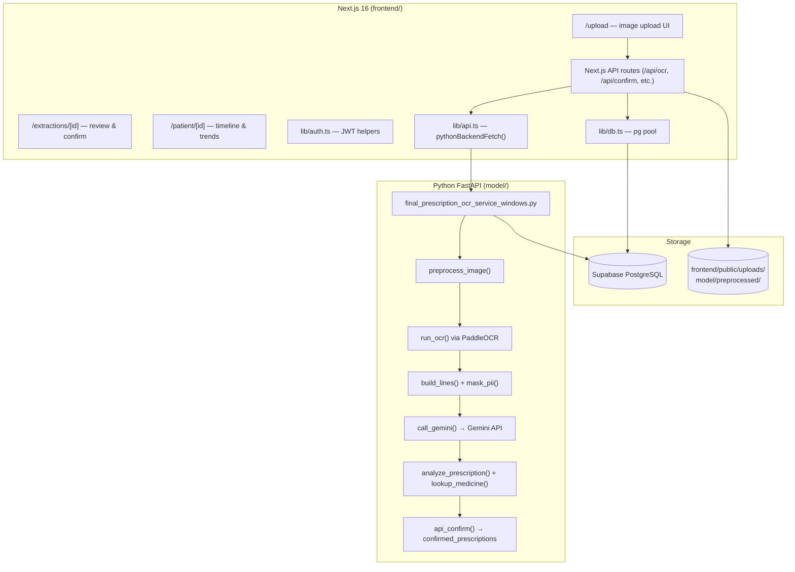

# 02 — Architecture

## System Context

A browser connects to the Next.js frontend (port 3000). The frontend proxies OCR and confirmation requests to the Python FastAPI backend (port 8000). The backend calls the Google Gemini API (external) and reads/writes to Supabase PostgreSQL (external or local SQLite for dev).

```mermaid
C4Context
    title System Context — Single-Hospital-Pro
    Person(user, "Patient / Clinician", "Uploads prescription image, reviews and confirms draft")
    System(frontend, "Next.js Frontend", "Web UI + API proxy routes, port 3000")
    System(backend, "Python FastAPI Backend", "OCR, LLM structuring, validation, DB ORM, port 8000")
    SystemExt(gemini, "Google Gemini API", "Multimodal LLM structuring (external)")
    SystemDb(db, "Supabase PostgreSQL", "All persistent data (external or local SQLite)")

    Rel(user, frontend, "HTTPS browser")
    Rel(frontend, backend, "HTTP + X-API-Key header")
    Rel(backend, gemini, "HTTPS REST (google-genai SDK)")
    Rel(backend, db, "TCP + SSL (SQLAlchemy + psycopg2)")
    Rel(frontend, db, "TCP + SSL (pg pool, Next.js API routes)")
```

## Component Diagram



## Component Table

| Component | Location | Responsibility | Technology |
|---|---|---|---|
| Python OCR & LLM Service | `model/final_prescription_ocr_service_windows.py` | All backend logic: image preprocessing, OCR, LLM, validation, DB ORM, REST API | FastAPI, PaddleOCR, google-genai, SQLAlchemy, RapidFuzz |
| Next.js Frontend | `frontend/` | Web UI, auth, API proxying, patient timeline | Next.js 16 (App Router), React 19, TypeScript, TailwindCSS 4 |
| Next.js API Routes | `frontend/app/api/` | JWT auth enforcement, forwarding to Python service, writing `Document` records | Next.js Route Handlers |
| Auth helpers | `frontend/lib/auth.ts` | JWT sign/verify, bcrypt password hash, 9-digit patient ID generator | jsonwebtoken, bcryptjs |
| DB pool (frontend) | `frontend/lib/db.ts` | PostgreSQL connection pool for Next.js queries | pg |
| API client (frontend) | `frontend/lib/api.ts` | HTTP client wrapping Python service calls | fetch |
| MedicineEditor | `frontend/components/MedicineEditor.tsx` | Interactive medicine field editor before confirmation | React |
| Bulk importer | `model/import_medicines_bulk.py` | High-speed batch import of CSV/JSON datasets into `medicine_master` | SQLAlchemy, csv |
| Standalone OCR server | `app.py` | Minimal OCR endpoint — raw bounding boxes only, no LLM, no DB | FastAPI, PaddleOCR |
| Schema SQL | `scratch/supabase_schema.sql` | Reference SQL for all tables including Next.js EHR tables | PostgreSQL |

## Current vs Target Architecture

### Current (Confirmed)

- Single Python process runs OCR, LLM, DB ORM, and REST API.
- Medicine matching: in-memory `MED_INDEX` dict + RapidFuzz string similarity.
- No GPU; CPU-only PaddleOCR inference.
- SQLite fallback for local development; Supabase PostgreSQL for deployment.

### Target (PLANNED)

- GPU acceleration for PaddleOCR (NVIDIA CUDA).
- Hybrid medicine matching: SQL trigram (`pg_trgm`) + vector (`pgvector`) for candidate retrieval, relational SQL as sole fact source.
- Full Indian medicine database (NLEM / Jan Aushadhi / CDSCO) loaded into `medicine_master`.
- Real-time WebSocket progress updates instead of client polling.
- Multi-page PDF prescription support.
- Object storage (S3 / GCS) for prescription images.

## Key Design Principles

| Principle | Where enforced |
|---|---|
| Human in the loop | Every extraction gets status `PENDING_USER_CONFIRMATION`; no auto-confirm path exists |
| LLM is not a source of truth | Medicine facts come only from `medicine_master`; LLM structures text, never generates drug data |
| Traceability | Every extracted field carries `src` (OCR line IDs); `audit_log` records every pipeline event |
| PII before LLM | `mask_pii()` strips emails and phone numbers before the prompt is sent to Gemini |
| Safe OCR corrections | Auto-corrected fields are flagged `check`; near-match drugs are never auto-accepted |

## External Dependencies and Data Leaving the System

| External service | Data sent | Masked before send? |
|---|---|---|
| Google Gemini API | Prescription image bytes + OCR line text | Emails and phone numbers replaced with `[EMAIL]`/`[PHONE]` by `mask_pii()` (Confirmed) |
| Supabase PostgreSQL | All structured data including patient records | Encrypted in transit via TLS (connection string uses `sslmode=require` via Supabase default) |

> Patient names, UHID, diagnosis, and medicine data **are sent to Google Gemini**. This is a material privacy consideration. See [docs/08_SECURITY_PRIVACY.md](08_SECURITY_PRIVACY.md).

## Failure Modes

| Failure | Detection | Handling |
|---|---|---|
| Gemini model unavailable (429/503/404) | `call_gemini()` catches exception, checks error code | Fast-fail to next candidate in `MODEL_CANDIDATES`; HTTP 502 if all fail |
| No text found in image | `build_lines()` returns empty list | HTTP 422 with message asking user to re-upload clearer photo |
| DB connection lost | `pool_pre_ping=True`; `pool_recycle=180` | SQLAlchemy reconnects; if unavailable at startup, `RuntimeError` raised |
| Duplicate prescription upload | `process_image()` checks SHA-256 hash per patient | Returns existing extraction with `duplicate=true` flag |
| Image too large | `len(data) > MAX_UPLOAD_MB * 1024 * 1024` | HTTP 413 |
| Wrong file type | MIME type check in `api_ocr()` | HTTP 415 |
| Confirmation of already-confirmed extraction | `ex["status"] == "CONFIRMED"` check in `api_confirm()` | HTTP 409 unless `allow_duplicate=true` |
