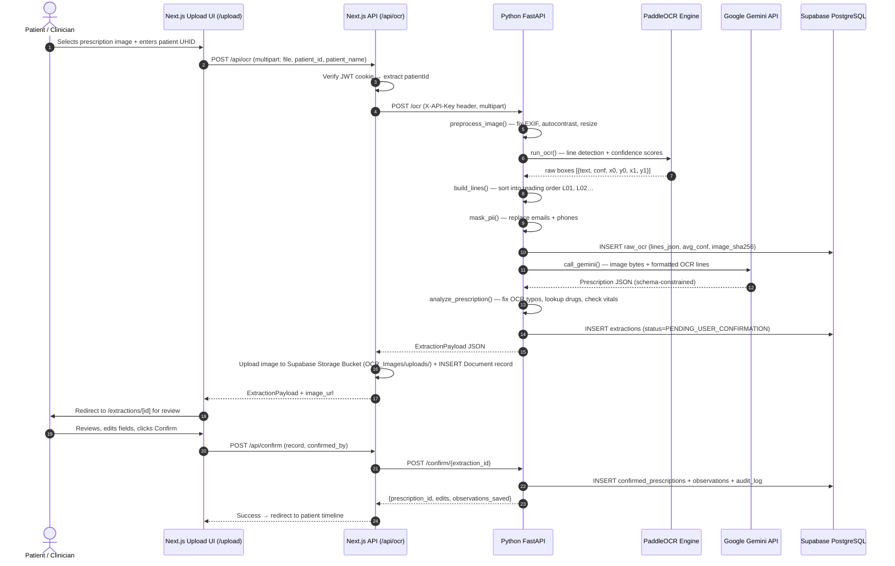

# 03 — Pipeline Specification

## Complete Request Sequence Diagram



---

## Stage 1 — Image Preprocessing

**Function:** `preprocess_image(data: bytes)` → `(path: str, size: (w, h))`  
**Location:** `model/final_prescription_ocr_service_windows.py` → `preprocess_image()`  
**Claim:** Confirmed

**Input:** Raw image bytes (JPEG, PNG, WebP)  
**Output:** Path to a cleaned PNG saved in `model/preprocessed/<sha256_prefix>.png`

**Operations (in order):**
1. `Image.open()` + `ImageOps.exif_transpose()` — corrects phone camera rotation from EXIF metadata.
2. `.convert("RGB")` — strips alpha channel; normalises colour space.
3. `ImageOps.autocontrast(cutoff=1)` — enhances faded ink contrast by clipping 1% of darkest/brightest pixels.
4. Resize: if `max(w, h) < 1000` → scale up to 1000px long side; if `max(w, h) > 2048` → scale down to 2048px long side. Uses `Image.Resampling.BILINEAR`.
5. `img.save(out, optimize=True)` — PNG with optimisation.

**Parameters:**

| Parameter | Value | Set in |
|---|---|---|
| `min_long_side` | 1000 px | `preprocess_image()` default arg |
| `max_long_side` | 2048 px | `preprocess_image()` default arg |
| `autocontrast cutoff` | 1 | `preprocess_image()` call |

**Failure handling:** Any `PIL` exception propagates as `PipelineError(http=400)`.  
**Known weaknesses:** No perspective deskewing (`USE_UNWARPING = False`). Severely creased or curved pages degrade OCR.

---

## Stage 2 — OCR Inference

**Function:** `run_ocr(path, fallback_size)` → `(raw: list, (w, h))`  
**Location:** `model/final_prescription_ocr_service_windows.py` → `run_ocr()`  
**Claim:** Confirmed

**Input:** Path to preprocessed PNG, fallback image size tuple  
**Output:** List of raw box dicts: `{text, conf, x0, y0, x1, y1}`

**Engine selection (Confirmed — `OCR_ENGINE_TYPE` env var):**
- `PaddleOCR` (default): calls `ocr.ocr(path, cls=True)`, parses `[[box, (text, conf)]]` format.
- `PaddleOCR-VL`: calls `ocr.predict(path)`, parses `parsing_res_list` or `rec_texts` format.

**OCR init parameters (Confirmed):**
- `use_textline_orientation=True` — corrects rotated text lines.
- `lang` = env `PADDLEOCR_LANG` (default `"en"`).
- `enable_mkldnn=False` — disabled due to PaddlePaddle 3.x MKL-DNN bug.
- Protected by `OCR_LOCK` — single-threaded OCR access.

**Filters:** Boxes with no alphanumeric characters (`re.search(r"[A-Za-z0-9]", text)`) are dropped.

**Failure handling:** Exception raises `PipelineError(http=500)`.

---

## Stage 3 — Line Building (Reading Order)

**Function:** `build_lines(raw, img_w, img_h)` → `list[dict]`  
**Location:** `model/final_prescription_ocr_service_windows.py` → `build_lines()`  
**Claim:** Confirmed

**Input:** Raw OCR box list, image dimensions  
**Output:** Sorted, numbered line list:

```json
[
  {"id": "L01", "row": 1, "text": "City Care Hospital", "conf": 0.992, "x": 0.15, "y": 0.08},
  {"id": "L04", "row": 2, "text": "Tab Metformin 500mg", "conf": 0.965, "x": 0.12, "y": 0.28}
]
```

**Algorithm:**
1. Compute `cy` (vertical centre) and `h` (height) for each box.
2. Sort all boxes by `cy` (top to bottom).
3. Group boxes into rows: a box belongs to the current row if `|cy - row_cy| <= 0.6 * median_height`.
4. Within each row, sort boxes left to right by `x0`.
5. Assign sequential IDs `L01`, `L02`, … and 1-based row numbers.
6. `x` = `x0 / img_w` (normalised 0–1), `y` = `cy / img_h` (normalised 0–1).

**Row threshold parameter:** `0.6 * median_height` — grouping tolerance for boxes on the same visual line.  
**Known weakness:** Single-character fields (e.g., "F" for sex, "M" for male) can be dropped by the row-clustering step if their bounding box is very small.

---

## Stage 4 — PII Masking

**Function:** `mask_pii(text)` → `str`  
**Location:** `model/final_prescription_ocr_service_windows.py` → `mask_pii()`  
**Claim:** Confirmed

**Purpose:** Strip clinic contact information before sending text to the external Gemini API.  
**What is masked:** Email addresses → `[EMAIL]`; Indian and international phone numbers → `[PHONE]`.  
**What is NOT masked:** Patient names, UHID, diagnosis, medicine names — these are sent to Gemini.

---

## Stage 5 — LLM Structuring

**Function:** `call_gemini(lines, image_path, retries_per_model=2)` → `(Prescription, model_name)`  
**Location:** `model/final_prescription_ocr_service_windows.py` → `call_gemini()`  
**Claim:** Confirmed

**Input:** OCR line list (after PII masking), path to preprocessed image (when `SEND_IMAGE_TO_LLM=True`)  
**Output:** Validated `Prescription` Pydantic object + name of model that succeeded

**Prompt construction:**
1. If `SEND_IMAGE_TO_LLM = True`: insert image bytes as `types.Part.from_bytes()` as first content part.
2. Append formatted OCR block via `lines_to_prompt_block()`.
3. Append visual transcription instruction text.

**Configuration (Confirmed):**

| Parameter | Value | Location |
|---|---|---|
| `response_mime_type` | `"application/json"` | `cfg` in `call_gemini()` |
| `response_schema` | `Prescription` Pydantic model | `cfg` in `call_gemini()` |
| `system_instruction` | `SYSTEM_PROMPT` string | `cfg` in `call_gemini()` |
| Per-model timeout | 30 seconds | `future.result(timeout=30)` |
| Retries per model | 2 | `retries_per_model=2` default |
| Model candidate list | 9 models, `gemini-2.5-flash` first | `MODEL_CANDIDATES` constant |
| `SEND_IMAGE_TO_LLM` | `True` | Module-level constant |

**Fallback logic:** For each model in `MODEL_CANDIDATES`, attempt up to `retries_per_model` times. On 503/429/404 errors → immediate fast-fail to next model. On other errors → wait 2 s, retry. If all candidates exhausted → `RuntimeError` → wrapped as `PipelineError(http=502)`.

**Schema enforcement:** `Prescription.model_validate_json(response.text)` — Pydantic v2 validates the JSON against the schema. Any validation error is treated as a model failure and triggers fallback.

**Prompt text:** See [docs/10_PROMPT_REGISTRY.md](10_PROMPT_REGISTRY.md) for the exact text and version.

---

## Stage 6 — Validation and Medicine Mapping

**Functions:** `analyze_medicine()`, `lookup_medicine()`, `fix_digits()`, `fix_frequency()`, `fix_duration()`, `parse_vital()`, `analyze_prescription()`  
**Location:** `model/final_prescription_ocr_service_windows.py`  
**Claim:** Confirmed

### OCR typo auto-correction

| Corrector | What it fixes | Flag applied |
|---|---|---|
| `fix_digits(s)` | Letter-to-digit confusions inside numeric tokens (`5o0`→`500`, `I cap`→`1 cap`) | `check` |
| `fix_frequency(s)` | OCR confusion in dose schedules (`1-O-1`→`1-0-1`, `QGH`→`Q6H`) | `check` |
| `fix_duration(s)` | Numeric part of duration (`Sd`→`5d`, `x 3O days`→`x 30 days`) | `check` |

### Format validators (regex)

| Field | Regex | Invalid → flag |
|---|---|---|
| `strength` | `STRENGTH_RE` — `N[unit][/N[unit]]*` | `format_invalid` issue |
| `frequency` | `FREQ_RE` — dash-separated, abbreviations | `format_invalid` issue |
| `duration` | `DURATION_RE` — `Nd`, `Nw`, `Nm`, continue, lifelong | `format_invalid` issue |

### Medicine lookup — `lookup_medicine(name)`

1. Normalise: lowercase, collapse whitespace, strip non-alphanumeric except space and hyphen.
2. Exact match in `MED_INDEX` dict → `{status: "exact", score: 100, row: {...}}`.
3. If `len(name) >= 5` and `MED_INDEX` is populated: fuzzy match via `rapidfuzz.process.extractOne` with `fuzz.ratio`. If best score >= 85 → `{status: "near", score: N}`.
4. Otherwise → `{status: "none"}`.

**Safety rule:** Near matches are never auto-accepted. They generate a `near_match` issue that the UI must surface to the clinician.

### Per-field confidence flag

| Condition | Flag |
|---|---|
| Field absent | `missing` (critical) or `empty` (non-critical) |
| `conf < THRESH_LOW` (0.75) | `low` |
| `conf < THRESH_OK` (0.90) OR has issues OR was auto-corrected | `check` |
| Otherwise | `ok` |

### Quality gate — `analyze_prescription()`

| Gate status | Condition |
|---|---|
| `HIGH_CONFIDENCE` | No issues, no LOW fields, identity and date resolved |
| `NEEDS_CHECK` | Any issue, missing date, identity problem, or vital out of bounds |
| `LOW_QUALITY` | `looks_like_prescription=False`, or no medicines, or majority of medicines are LOW |

### Vitals parsing — `parse_vital(name, value)`

Supported `kind` values: `bp`, `sugar_fasting`, `sugar_post_meal`, `sugar_random`, `sugar_unspecified`, `hba1c`, `pulse`, `temp`, `spo2`, `weight`.

BP constraint: `60 <= systolic <= 260` and `30 <= diastolic <= 160` and `systolic > diastolic`.  
Temperature: classified as `F` if value >= 90 else `C`; bounds checked accordingly.

---

## Stage 7 — Raw OCR Storage

**Location:** `model/final_prescription_ocr_service_windows.py` → `process_image()`  
**Claim:** Confirmed

Raw OCR is committed to the `raw_ocr` table **before** calling the LLM. This ensures the source text is preserved even if all Gemini calls fail, enabling later retry via `POST /structure/{ocr_id}`.

---

## Stage 8 — Draft Extraction Storage

**Location:** `model/final_prescription_ocr_service_windows.py` → `structure_from_raw()`  
**Claim:** Confirmed

After successful LLM structuring and validation, a row is inserted into `extractions` with `status="PENDING_USER_CONFIRMATION"` and `analysis_json` containing the full `{record, gate, warnings}` dict. `audit_log` gets an `"extracted"` event.

---

## Stage 9 — Human Review (Frontend)

**Location:** `frontend/app/extractions/[id]/page.tsx`, `frontend/components/MedicineEditor.tsx`  
**Claim:** Confirmed

The clinician sees the quality gate badge, raw OCR lines (via `RawOcrViewer`), and editable medicine fields. They can add, remove, and modify any field. Status badges (`ok`, `check`, `low`, `missing`) guide attention.

---

## Stage 10 — Confirmation and Profile Building

**Function:** `api_confirm(extraction_id, body: ConfirmBody)`  
**Location:** `model/final_prescription_ocr_service_windows.py` → `api_confirm()`  
**Claim:** Confirmed

1. Validate extraction exists and is not already `CONFIRMED` or `DISCARDED`.
2. Resolve `date_iso` (from body or re-parse from `date_raw`; default today if absent).
3. Reject if no medicines in the record (HTTP 422).
4. Duplicate check: same `patient_id + rx_date + medicine name set` → HTTP 409 unless `allow_duplicate=true`.
5. Compute `edits` diff between original machine output and user-confirmed record.
6. INSERT `confirmed_prescriptions` with confirmed record.
7. For each vital in `rec["vitals"]`: parse via `parse_vital()`, if `ok` → INSERT `observations`.
8. UPDATE `extractions.status` to `"CONFIRMED"` and sync `analysis_json` with confirmed record.
9. INSERT `audit_log` event `"confirmed"`.

**Known weakness:** If `date_iso` is absent and cannot be parsed, it silently defaults to today's date.
