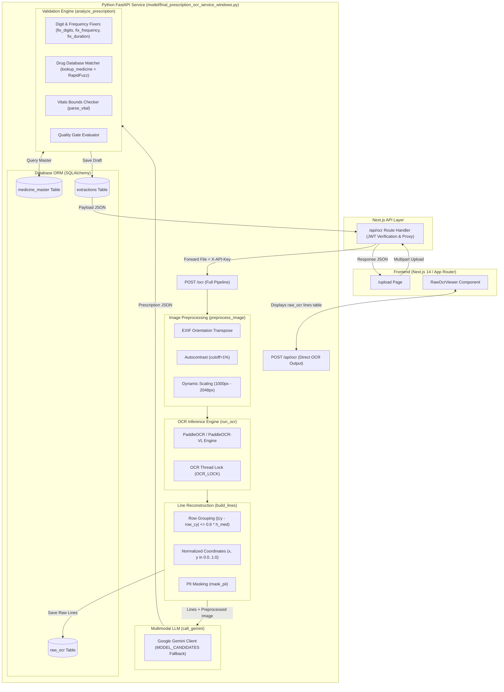
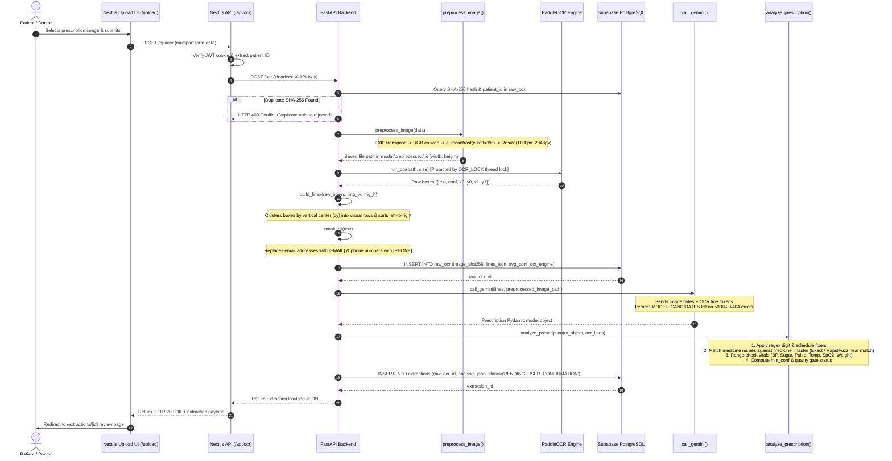

# 14 — OCR Engine & Vision Pipeline Documentation

> [!NOTE]
> This document reflects **strictly what is currently implemented in the codebase**. All functions, regex patterns, database tables, threshold values, fallback models, and UI components listed below have been verified against source code in `model/final_prescription_ocr_service_windows.py`, `frontend/app/api/ocr/route.ts`, and `frontend/components/RawOcrViewer.tsx`.

---

## 1. Subsystem Overview

The Single-Hospital Pro OCR subsystem digitises prescription images using a **Hybrid OCR + LLM Vision Fusion** pipeline.

It combines:
1. **Local Deep Learning OCR (`PaddleOCR` / `PaddleOCR-VL`)**: Detects bounding boxes, text coordinates, line orientation, and word confidence scores.
2. **Spatial Geometry Clustering (`build_lines`)**: Groups detected text boxes into visual lines and horizontal rows using coordinate geometry.
3. **Multimodal LLM Reasoning (`Google Gemini`)**: Sends preprocessed image bytes and structured OCR line tokens to Gemini 2.5/3.x models to transcribe handwriting and output a Pydantic `Prescription` JSON schema.
4. **Clinical Validation & Drug Verification**: Applies regex digit fixers, verifies drug names against the `medicine_master` database (using `RapidFuzz` fuzzy matching), range-checks vitals, and assigns confidence flags (`ok`, `check`, `low`, `missing`).

---

## 2. Implemented Architecture & Component Map



---

## 3. Implemented Execution Flow



---

## 4. Line-by-Line Technical Code Verification

### 4.1. Image Preprocessing Subsystem
**Function:** `preprocess_image(data: bytes, min_long_side=1000, max_long_side=2048)`  
**Location:** `model/final_prescription_ocr_service_windows.py` (lines 372–384)

**Actual Implementation Steps:**
1. `Image.open(io.BytesIO(data))`: Loads image bytes using PIL.
2. `ImageOps.exif_transpose(img).convert("RGB")`: Reads EXIF orientation tag `274` to rotate phone uploads right-side up, then converts to 3-channel RGB.
3. `ImageOps.autocontrast(img, cutoff=1)`: Clips 1% of lightest and darkest pixels to enhance contrast of faint ink on paper.
4. **Resolution scaling**:
   - Computes `long_side = max(w, h)`.
   - If `long_side < 1000` or `long_side > 2048`, calculates scale factor `s` and resizes with `Image.Resampling.BILINEAR`.
5. **Saving**: Saves output PNG to `model/preprocessed/<sha256_prefix_16char>.png` with `optimize=True`.

---

### 4.2. Dual-Engine OCR Inference
**Function:** `run_ocr(path, fallback_size)`  
**Location:** `model/final_prescription_ocr_service_windows.py` (lines 428–521)

**Actual Implementation Details:**
* **Engine Select**: Checks environment variable `OCR_ENGINE_TYPE`. If `"paddleocr-vl"` or `"vl"`, uses `PaddleOCRVL()`. Otherwise defaults to standard `PaddleOCR(use_textline_orientation=True, lang="en", enable_mkldnn=False)`.
* **Thread Safety**: Access to `ocr` instance is synchronized via `with OCR_LOCK:` to prevent concurrent execution crashes.
* **Primary Path**: Calls `ocr.ocr(path, cls=True)` which returns bounding boxes `[x0, y0]`, `[x1, y0]`, `[x1, y1]`, `[x0, y1]`, extracted text, and confidence score `conf`.
* **Fallback Path**: Calls `ocr.predict(path)` if `ocr.ocr()` raises an exception.
* **Text Filter**: Filters out bounding boxes containing no alphanumeric characters (`re.search(r"[A-Za-z0-9]", text)`).

---

### 4.3. Spatial Line Reconstruction & Reading Order
**Function:** `build_lines(raw, img_w, img_h)`  
**Location:** `model/final_prescription_ocr_service_windows.py` (lines 525–564)

**Actual Implementation Logic:**
1. Computes vertical center `cy = (y0 + y1) / 2` and height `h = y1 - y0` for every box.
2. Computes `med_h = statistics.median(r["h"] for r in raw)`.
3. Sorts boxes vertically by `cy`.
4. Groups boxes into visual rows: a box is added to the current row if `abs(r["cy"] - row_cy) <= 0.6 * med_h`. Otherwise, starts a new row.
5. Within each row, sorts boxes horizontally by `x0` (left to right).
6. Assigns line IDs `L01`, `L02`, ..., row number `row`, text `text`, confidence `conf` (rounded to 4 decimals), and normalized coordinates `x = x0 / img_w`, `y = cy / img_h` (rounded to 3 decimals).

---

### 4.4. PII Privacy Masking
**Function:** `mask_pii(text)`  
**Location:** `model/final_prescription_ocr_service_windows.py` (lines 566–582)

**Actual Implementation Rules:**
* Email pattern: `re.sub(r"[\w.+-]+@[\w-]+\.[\w.]+", "[EMAIL]", text)`
* Phone pattern: `re.sub(r"(?<!\d)(?:\+?91[- ]?)?\d{2,5}[- ]?\d{6,8}(?!\d)", "[PHONE]", text)`

---

### 4.5. Multimodal LLM Vision Structuring
**Function:** `call_gemini(lines, image_path=None, retries_per_model=2)`  
**Location:** `model/final_prescription_ocr_service_windows.py` (lines 675–755)

**Actual Implementation Logic:**
* **Image Transmission**: Controlled by flag `SEND_IMAGE_TO_LLM = True`. When `True` and `image_path` is passed, reads image bytes and inserts `types.Part.from_bytes(data, mime_type)` as the first content element to Gemini.
* **OCR Prompt Text**: Formats OCR lines into block:
  ```text
  L01 | row 1 | x=0.15 y=0.08 | conf=0.992 | City Care Hospital
  L02 | row 2 | x=0.12 y=0.28 | conf=0.965 | Tab Metformin 500mg
  ```
* **Schema Enforcement**: Uses `google-genai` SDK with `response_mime_type="application/json"` and `response_schema=Prescription` (Pydantic model).
* **Model Candidates & Fallback List**:
  ```python
  MODEL_CANDIDATES = [
      "gemini-2.5-flash",
      "gemini-2.5-pro",
      "gemini-2.0-flash",
      "gemini-3.5-flash-lite",
      "gemini-flash-lite-latest",
      "gemini-3.5-flash",
      "gemini-flash-latest",
      "gemini-3.7-flash",
      "gemini-3.1-flash-lite"
  ]
  ```
* **Execution Timeout & Fallback**: Each call is executed in a thread pool with a 30-second timeout (`future.result(timeout=30)`). If an HTTP 503, 429, 404, or UNAVAILABLE error occurs, it immediately fast-fails to the next model in `MODEL_CANDIDATES`.

---

### 4.6. Clinical Validation, Drug Verification & Quality Gate
**Functions:** `analyze_prescription()`, `lookup_medicine()`, `parse_vital()`, `fix_digits()`, `fix_frequency()`, `fix_duration()`  
**Location:** `model/final_prescription_ocr_service_windows.py` (lines 765–1103)

#### 1. Regex Typo Auto-Corrections
* `fix_digits(s)`: Replaces letter-to-digit confusions (`o`/`O` \(\rightarrow\) `0`, `l`/`I` \(\rightarrow\) `1`, `S` \(\rightarrow\) `5`, `G` \(\rightarrow\) `6`) inside tokens containing digits (e.g. `5o0` \(\rightarrow\) `500`), plus `I cap` \(\rightarrow\) `1 cap`.
* `fix_frequency(s)`: Replaces letter confusions in schedule patterns (`1-O-1` \(\rightarrow\) `1-0-1`, `QGH` \(\rightarrow\) `Q6H`).
* `fix_duration(s)`: Fixes duration tokens (`Sd` \(\rightarrow\) `5d`, `x 3O days` \(\rightarrow\) `x 30 days`).

#### 2. Drug Database Matching (`lookup_medicine`)
* Checks `MED_INDEX` dictionary populated from `medicine_master` database table.
* **Exact Match**: Returns `status="exact"`, `score=100`, attaching generic name, composition, and uses.
* **Fuzzy Near Match (`RapidFuzz`)**: If drug name length \(\ge 5\), executes `rapidfuzz.process.extractOne` with `fuzz.ratio`. If score \(\ge 85\), returns `status="near"`, `score=N`, and flags a `near_match` issue for mandatory user confirmation.
* **Unverified Match**: Returns `status="none"`, attaching a warning that the drug was not found in `medicine_master`.

#### 3. Vitals Bounds Validation (`parse_vital`)
* `bp`: Requires `60 <= systolic <= 260`, `30 <= diastolic <= 160`, and `systolic > diastolic`.
* `sugar_fasting`, `sugar_post_meal`, `sugar_random`, `sugar_unspecified`: Bounds checked (`20 <= value <= 800 mg/dL` or `1 <= value <= 45 mmol/L`).
* `hba1c`: Bounds checked (`3 <= value <= 20%`).
* `pulse`: Bounds checked (`30 <= value <= 220 /min`).
* `temp`: Bounds checked (`90 <= value <= 110 F` or `30 <= value <= 43 C`).
* `spo2`: Bounds checked (`50 <= value <= 100%`).
* `weight`: Bounds checked (`1 <= value <= 300 kg`).

#### 4. Confidence Thresholds & Field Flags
* `field_conf()`: Computes the minimum confidence score of all OCR line IDs in `src`.
* `THRESH_OK = 0.90`, `THRESH_LOW = 0.75`.
* **Field Flags**:
  * `ok`: Confidence \(\ge 0.90\) and no validation errors.
  * `low`: Confidence \(< 0.75\).
  * `check`: Confidence \(0.75 - 0.89\), or auto-corrected, or format issue present.
  * `missing`: Critical field missing (`name`, `strength`, `frequency`, `duration`).

#### 5. Page Quality Gate (`gate.status`)
* `HIGH_CONFIDENCE`: No issues, no `low` fields, patient name & date verified.
* `NEEDS_CHECK`: Any validation issue, missing date, patient mismatch, or vital out of bounds.
* `LOW_QUALITY`: `looks_like_prescription == False`, no medicines extracted, or \(\ge 50\%\) of medicines have `low` status.

---

## 5. Verified Database Schema

```sql
-- Table 1: Raw OCR Bounding Boxes & Text Lines
CREATE TABLE raw_ocr (
    id SERIAL PRIMARY KEY,
    image_sha256 VARCHAR(64) INDEX,
    patient_id VARCHAR(64) INDEX,
    filename VARCHAR(255),
    ocr_engine VARCHAR(64),
    image_w INTEGER,
    image_h INTEGER,
    avg_conf FLOAT,
    lines_json TEXT, -- JSON string of [{id, row, text, conf, x, y}]
    created_at VARCHAR(32)
);

-- Table 2: Machine Extraction Drafts
CREATE TABLE extractions (
    id SERIAL PRIMARY KEY,
    raw_ocr_id INTEGER INDEX,
    llm_model VARCHAR(64),
    analysis_json TEXT, -- JSON string of {record, gate, warnings}
    status VARCHAR(32) INDEX, -- PENDING_USER_CONFIRMATION | CONFIRMED | DISCARDED
    created_at VARCHAR(32)
);

-- Table 3: Authenticated Medicine Knowledge Base
CREATE TABLE medicine_master (
    id SERIAL PRIMARY KEY,
    name VARCHAR(120) UNIQUE,
    generic VARCHAR(160),
    composition TEXT,
    uses TEXT,
    strengths_mg VARCHAR(200),
    source VARCHAR(80)
);

-- Table 4: Confirmed Prescriptions (Patient Record)
CREATE TABLE confirmed_prescriptions (
    id SERIAL PRIMARY KEY,
    extraction_id INTEGER UNIQUE,
    patient_id VARCHAR(64) INDEX,
    rx_date VARCHAR(10) INDEX, -- YYYY-MM-DD
    hospital VARCHAR(255),
    doctor VARCHAR(255),
    doctor_reg_no VARCHAR(64),
    data_json TEXT, -- final record user confirmed
    edits_json TEXT, -- diff between LLM output and user edits
    confirmed_by VARCHAR(64),
    confirmed_at VARCHAR(32)
);

-- Table 5: Numeric Vitals & Observations
CREATE TABLE observations (
    id SERIAL PRIMARY KEY,
    patient_id VARCHAR(64) INDEX,
    prescription_id INTEGER INDEX,
    obs_date VARCHAR(10) INDEX,
    kind VARCHAR(24) INDEX, -- bp | sugar_fasting | sugar_post_meal | sugar_random | hba1c | pulse | temp | spo2 | weight
    systolic FLOAT,
    diastolic FLOAT,
    value FLOAT,
    unit VARCHAR(16),
    raw_text VARCHAR(120),
    created_at VARCHAR(32)
);
```

---

## 6. Frontend Raw OCR Viewer Component

**Component:** `<RawOcrViewer data={rawOcrData} />`  
**Location:** `frontend/components/RawOcrViewer.tsx`

**Actual Implemented UI Features:**
* **Header Statistics Bar**:
  * OCR Engine name (`data.ocr_engine`, e.g. `"PaddleOCR"`).
  * Total OCR Lines count (`data.lines.length`).
  * Average Confidence score formatted as a percentage (`(data.avg_conf * 100).toFixed(1)%`).
  * Image Resolution (`data.image_w × data.image_h px`).
* **Live Search Filter Input**: Real-time filtering of lines by text snippet or line ID (`L01`, `L02`...).
* **OCR Data Table**:
  * **Line ID**: Rendered in teal monospace text (`L01`, `L02`...).
  * **Row Number**: 1-based vertical row index.
  * **Extracted Text**: Cleaned string output.
  * **Confidence Bar**: Visual progress bar color-coded in teal (\(\ge 75\%\)) or amber (\(< 75\%\)) with percentage label.

---

## 7. HTTP API Endpoint Reference

| Method | Endpoint Path | Authentication | Request Format | Implemented Response |
|---|---|---|---|---|
| `GET` | `/health` | None | None | `{ok: true, ocr: "PaddleOCR", medicine_names_indexed: N, time: "..."}` |
| `POST` | `/api/ocr` | Optional Key | `multipart/form-data`: `file`, `patient_id` | `{success: true, filename: "...", predictions_count: N, results: [{box: [[x0,y0],[x1,y0],[x1,y1],[x0,y1]], text: "...", confidence: 0.99}]}` |
| `POST` | `/ocr` | `X-API-Key` | `multipart/form-data`: `file`, `patient_id`, `patient_name` | `{ocr_id: N, extraction_id: N, status: "PENDING_USER_CONFIRMATION", llm_model: "...", record: {...}, gate: {...}, warnings: [...]}` |
| `POST` | `/structure/{ocr_id}` | `X-API-Key` | Path param `ocr_id`, optional query `patient_name` | Re-runs Gemini LLM on stored `raw_ocr` lines without re-running PaddleOCR |
| `GET` | `/raw_ocr/{id}` | `X-API-Key` | Path param `id` | `{id: N, lines_json: "[...]", avg_conf: 0.98, ocr_engine: "PaddleOCR"}` |
| `POST` | `/confirm/{extraction_id}` | `X-API-Key` | JSON body `{record, confirmed_by, allow_duplicate}` | `{prescription_id: N, edits: {...}, observations_saved: N}` |
| `POST` | `/discard/{extraction_id}` | `X-API-Key` | Path param `extraction_id` | `{status: "DISCARDED"}` |
