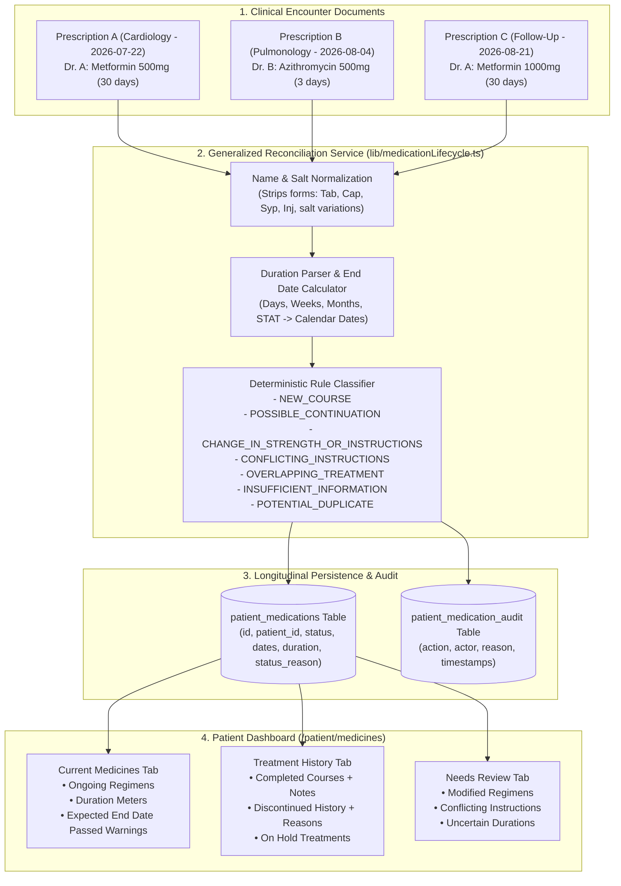
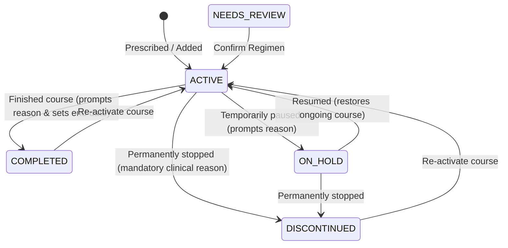

# Medication Lifecycle Management Engine

The **Medication Lifecycle Management Engine** provides generalized, evidence-based tracking and reconciliation of medications across multiple clinical visits, medical conditions, injuries, follow-up encounters, and overlapping treatment periods.

It resolves the fundamental clinical problem of fragmented prescription snapshots without relying on brittle, condition-specific heuristics (e.g. no hardcoding for fever, fractures, infections, diabetes, or any other specific illness).

---

## Table of Contents

1. [Core Clinical Problem Solved](#1-core-clinical-problem-solved)
2. [Data Ingestion Architecture: Where Data Comes From](#2-data-ingestion-architecture-where-data-comes-from)
3. [Calculating Conflicting Information & Clinical Discrepancies](#3-calculating-conflicting-information--clinical-discrepancies)
4. [Handling Previous Medications: Continuation vs Degradation](#4-handling-previous-medications-continuation-vs-degradation)
5. [Database Storage Architecture & Audit Trails](#5-database-storage-architecture--audit-trails)
6. [Patient Manual Controls: What Each Option Signifies & Reason Logging](#6-patient-manual-controls-what-each-option-signifies--reason-logging)
7. [Frontend Dashboard Experience (`/patient/medicines`)](#7-frontend-dashboard-experience-patientmedicines)
8. [Automated Verification & Test Evidence](#8-automated-verification--test-evidence)
9. [Original Prescription Image Inspection (`inspectModal`)](#9-original-prescription-image-inspection-inspectmodal)

---

## 1. Core Clinical Problem Solved

In traditional electronic health record systems and simple prescription viewers, each uploaded prescription is treated as an isolated list of medications. This leads to two critical clinical failures:

1. **Premature Deactivation:** Uploading a new prescription for an acute condition (e.g., an antibiotic for bronchitis or an NSAID for a sprained ankle) erroneously cancels, replaces, or archives existing long-term treatments (e.g., Metformin for diabetes or Amlodipine for hypertension).
2. **Naive Overwrite / Duplication:** A renewed prescription on a subsequent date either wipes out the prior dosage record or blindly creates duplicate courses without comparing strengths, frequencies, or prescribing physicians.

**The Medication Lifecycle Engine completely decouples the clinical document from the ongoing treatment course.** An uploaded prescription can initiate new courses, renew existing courses, or propose dosage changes, but it **never silently deletes or deactivates unrelated active treatments**.



---

## 2. Data Ingestion Architecture: Where Data Comes From

The medication lifecycle engine ingests data from multiple verified channels:

1. **Prescription OCR Pipeline (`prescription-ocr-backend`):**
   - High-resolution prescription images (scanned documents, camera uploads) uploaded by patients or clinics.
   - Processed via Google Cloud Vision and Gemini Medical OCR to extract structured JSON data:
     - Medication names, dosage forms, strengths, frequencies, routes, prescribed durations, and clinical indications.
     - Prescribing physician name, clinic/facility, and clinical encounter date (`rx_date`).
2. **Confirmed Prescription Entities (`confirmed_prescriptions` table):**
   - Once a doctor or patient confirms OCR results, structured records are stored in `confirmed_prescriptions` containing `data_json`, `rx_date`, `doctor`, and `hospital`.
   - Every confirmed document references its original scan stored in Supabase Cloud Storage.
3. **Manual Patient Additions:**
   - Patients or clinic assistants can add medications directly using the "Add Medication" modal dialog on `/patient/medicines`.
   - Captures drug name, strength, frequency, route, prescriber, indication, and start date.
4. **Clinical Encounter Metadata Rule:**
   - The engine strictly uses the clinical encounter date (`rx_date` or `date_iso`) to anchor treatment courses.
   - **Upload timestamps (`created_at`, `uploaded_at`) are never used as medication start dates.** This prevents skewing duration calculations when physical documents are uploaded days or weeks after a consultation.

---

## 3. Calculating Conflicting Information & Clinical Discrepancies

The engine evaluates incoming medications against existing patient treatment courses using generalized mathematical and string comparisons in `frontend/lib/medicationLifecycle.ts`:

### A. Normalization & Active Ingredient Matching
- Brand names and formulation strings are normalized using deterministic regex rules:
  - Strips pharmaceutical forms: `Tab`, `Tablet`, `Cap`, `Capsule`, `Syp`, `Syrup`, `Inj`, `Injection`, `Oint`, `Gel`, `Drops`, `Suspension`.
  - Removes strength substrings from the drug name (e.g. `"Metformin 500mg"` $\rightarrow$ `"Metformin"`).
  - Trims and lowercases active ingredient identifiers to compare across prescriptions.

### B. Prescribed Duration Parsing (`parsePrescribedDuration`)
- Converts unstructured natural language duration strings into integer calendar days:
  - `3 days` $\rightarrow$ `3`
  - `2 weeks` $\rightarrow$ `14`
  - `1 month` $\rightarrow$ `30`
  - `STAT` (immediate single dose) $\rightarrow$ `1`
  - `SOS` / `PRN` / Unspecified $\rightarrow$ `null` (flagged for review).

### C. Expected End Date Calculation (`calculateExpectedEndDate`)
- `expectedEndDate = startDate + durationDays` (formatted as ISO `YYYY-MM-DD`).
- Evaluated dynamically against `today`:
  - If `expectedEndDate < today`, the medication is flagged with `isExpectedEndDatePassed = true`.

### D. Deterministic Conflict & Reconciliation Categories
```
+------------------------------------+-----------------------------------------------------------------+---------------------+
| Classification Category            | Clinical Trigger Condition                                      | Assigned Status     |
+------------------------------------+-----------------------------------------------------------------+---------------------+
| NEW_COURSE                         | Drug molecule not previously recorded for patient.              | ACTIVE              |
| POTENTIAL_DUPLICATE                | Same drug, strength, frequency, and prescription date.          | Retains original    |
| POSSIBLE_CONTINUATION              | Same drug & dose on subsequent encounter by same clinician.     | ACTIVE              |
| CHANGE_IN_STRENGTH_OR_INSTRUCTIONS | Same drug on subsequent encounter with altered dose/frequency.  | NEEDS_REVIEW        |
| CONFLICTING_INSTRUCTIONS           | Different strengths/frequencies ordered on same encounter date. | NEEDS_REVIEW        |
| OVERLAPPING_TREATMENT              | Concurrent orders for same molecule by different clinicians.    | NEEDS_REVIEW        |
| INSUFFICIENT_INFORMATION           | Duration omitted or uncertain start date.                       | ACTIVE (Flagged)    |
+------------------------------------+-----------------------------------------------------------------+---------------------+
```

- When a discrepancy is detected:
  - `is_conflicting` is set to `true`.
  - Detailed diagnostic text is written to `conflict_details` (e.g. *"Potential dosage change from 500mg to 1000mg prescribed by Dr. Smith on 2026-08-21"*).
  - The record is automatically highlighted in the **Needs Review** view so clinicians or patients can confirm the change before administration.

---

## 4. Handling Previous Medications: Continuation vs Degradation

A fundamental principle of clinical pharmacology is that **co-existing medical conditions require simultaneous treatment**.

### The Non-Destructive Ingestion Rule
When a new prescription is confirmed:
1. **Unrelated Ongoing Medicines are NEVER Stopped:**
   - If a patient is on Metformin 500mg for diabetes, and a pulmonologist prescribes Azithromycin 500mg for acute bronchitis, Metformin remains 100% `ACTIVE`.
   - The system never assumes that a new visit replaces prior treatments for other conditions.
2. **Same Medication at the Same Strength (Renewals):**
   - Classified as `POSSIBLE_CONTINUATION`.
   - The start date, duration, and expected end date are updated to reflect the renewal without discarding prior encounter history.
3. **Same Medication with Changed Strength or Frequency (Modifications):**
   - The engine does **not** silently overwrite the old course or delete the historical dose.
   - It flags the course as `CHANGE_IN_STRENGTH_OR_INSTRUCTIONS` with status `NEEDS_REVIEW`.
   - The user or doctor can review the dosage adjustment and click **"Confirm Regimen"** to acknowledge the change.
4. **Expected End Date Passed $\neq$ Automatic Deletion:**
   - If a 5-day course ended yesterday, the system **does not silently move it to Completed or delete it**.
   - Patients frequently extend courses or forget doses; clinicians need to know whether the course was completed or if symptoms persisted.
   - The course remains `ACTIVE` with an amber `⚠️ Expected End Date Passed` badge, prompting explicit confirmation.

---

## 5. Database Storage Architecture & Audit Trails

All medication data and state transitions are stored across three PostgreSQL tables in Supabase:

### 1. `patient_medications` Table
Tracks ongoing and historical medication treatment courses:

| Column Name | Data Type | Description |
|---|---|---|
| `id` | `SERIAL PRIMARY KEY` | Unique treatment course ID. |
| `patient_id` | `VARCHAR(64)` | Normalized patient identifier. |
| `user_id` | `INTEGER` | Registered user account reference. |
| `prescription_id` | `INTEGER` | Reference to `confirmed_prescriptions`. |
| `name` | `VARCHAR(160)` | Original prescribed medication name. |
| `normalized_name` | `VARCHAR(160)` | Stripped active ingredient identifier. |
| `strength` | `VARCHAR(64)` | Dosage strength (e.g. `500mg`, `10mg/ml`). |
| `status` | `VARCHAR(32)` | `ACTIVE`, `COMPLETED`, `ON_HOLD`, `DISCONTINUED`, `NEEDS_REVIEW`. |
| `indication` | `VARCHAR(160)` | Medical indication or diagnosis (if specified). |
| `frequency` | `VARCHAR(80)` | Frequency instructions (e.g. `Twice daily after meals`). |
| `route` | `VARCHAR(40)` | Route of administration (default: `Oral`). |
| `prescription_date` | `VARCHAR(32)` | Encounter date on the physical prescription. |
| `start_date` | `VARCHAR(32)` | Treatment start date derived from encounter. |
| `duration_raw` | `VARCHAR(64)` | Prescribed duration string from OCR. |
| `duration_days` | `INTEGER` | Parsed duration in integer calendar days. |
| `expected_end_date`| `VARCHAR(32)` | Calculated completion date (`YYYY-MM-DD`). |
| `actual_end_date` | `VARCHAR(32)` | Date when course was completed or discontinued. |
| `status_reason` | `TEXT` | **Reason/notes provided for Completed, Hold, or Discontinue.** |
| `discontinued_reason`| `TEXT` | Historical clinical reason if discontinued. |
| `doctor` | `VARCHAR(160)` | Prescribing physician name. |
| `reference_id` | `VARCHAR(80)` | Prescription document reference ID. |
| `reconciliation_category` | `VARCHAR(64)` | `NEW_COURSE`, `POSSIBLE_CONTINUATION`, `CHANGE_IN_STRENGTH...` |
| `reconciliation_notes` | `TEXT` | Detailed clinical notes from reconciliation. |
| `is_conflicting` | `BOOLEAN` | Conflict flag for triage inbox. |
| `conflict_details` | `TEXT` | Discrepancy diagnosis text. |
| `source` | `VARCHAR(64)` | `Prescription Scan` or `Manual Entry`. |
| `reliability` | `VARCHAR(64)` | Data confidence rating (`High`, `Medium`). |
| `verification_status`| `VARCHAR(64)` | Verification state (`Prescription Verified`). |

### 2. `patient_medication_audit` Table
Immutable historical audit trail recording every state change, actor, and reason:

| Column Name | Data Type | Description |
|---|---|---|
| `id` | `SERIAL PRIMARY KEY` | Audit record ID. |
| `medication_id` | `INTEGER` | Foreign key to `patient_medications(id)`. |
| `patient_id` | `VARCHAR(64)` | Patient identifier. |
| `user_id` | `INTEGER` | User account that executed the action. |
| `action` | `VARCHAR(64)` | Action code (`COMPLETED`, `ON_HOLD`, `DISCONTINUED`, `RESUMED`, etc.). |
| `previous_status` | `VARCHAR(32)` | State before the transition. |
| `new_status` | `VARCHAR(32)` | State after the transition. |
| `reason` | `TEXT` | **Clinical reason captured from patient/doctor.** |
| `actor` | `VARCHAR(120)` | Full name or identifier of user who made the change. |
| `created_at` | `TIMESTAMP` | Server timestamp of the transaction. |

### 3. `confirmed_prescriptions` Table
Stores legal prescription document records with original OCR JSON and storage links:
- `data_json`: Full structured medicines array, patient diagnosis, instructions.
- `rx_date`: Date on prescription.
- `doctor`, `hospital`: Prescribing clinician and facility metadata.

---

## 6. Patient Manual Controls: What Each Option Signifies & Reason Logging

On `/patient/medicines`, patients and clinicians have interactive manual controls to manage their medication regimens based on clinical circumstances:



### Detailed Lifecycle Action Breakdown:

#### 1. Completed
- **What it Signifies:**
  The patient has successfully finished the prescribed course of treatment. Common scenarios include:
  - Antibiotic or antiviral course duration reached (e.g. 7-day course completed).
  - Acute pain or inflammation resolved as planned.
  - Doctor instructed ending treatment at follow-up visit.
- **System Behavior:**
  - Opens the interactive **Status Transition Modal** with emerald styling.
  - Displays "What Completed Signifies" guidance banner.
  - Offers 1-click suggested reason chips (*"Completed full prescribed duration"*, *"Symptoms fully resolved"*, *"Doctor advised course completion"*).
  - Prompts for optional completion notes in the message box.
  - Upon submission:
    - Sets `status = 'COMPLETED'`.
    - Sets `actual_end_date = today`.
    - Saves the note into `patient_medications.status_reason`.
    - Records an audit entry in `patient_medication_audit` with `action = 'COMPLETED'`.
    - Moves the medication card into the **Medical History** tab.

#### 2. Hold
- **What it Signifies:**
  The medication is **temporarily paused**, not permanently stopped. The prescription and dosage regimen remain intact. Common scenarios include:
  - Withholding anticoagulants or NSAIDs 3–5 days prior to an elective surgery or endoscopy.
  - Pausing a medication to observe whether a transient symptom (e.g. mild nausea or dizziness) resolves.
  - Awaiting blood test results (e.g. renal function or liver panel) before continuing.
  - Pausing during fasting or extended international travel.
- **System Behavior:**
  - Opens the interactive **Status Transition Modal** with amber styling.
  - Displays "What Hold Signifies" guidance banner explaining that the medication is not deleted.
  - Offers 1-click suggested reason chips (*"Temporary pause before procedure / surgery"*, *"Monitoring side effects / intolerance"*, *"Awaiting doctor consultation / lab results"*).
  - Requires a reason in the message box.
  - Upon submission:
    - Sets `status = 'ON_HOLD'`.
    - Saves the reason into `patient_medications.status_reason`.
    - Records an audit entry in `patient_medication_audit` with `action = 'ON_HOLD'`.
    - Updates card badge to `ON HOLD`.
    - Renders a **Resume** button on the card so the patient or doctor can reactivate it at any time with a single click.

#### 3. Discontinue
- **What it Signifies:**
  The medication has been **permanently stopped**. It should no longer be administered. Common scenarios include:
  - Severe allergic reaction (rash, angioedema, anaphylaxis).
  - Intolerable adverse side effects (severe gastrointestinal bleeding, persistent cough, hepatotoxicity).
  - Attending physician switched the patient to an alternative drug class or higher-line therapy.
  - Treatment proved ineffective after an adequate therapeutic trial.
- **System Behavior:**
  - Opens the interactive **Status Transition Modal** with rose styling.
  - Displays "What Discontinue Signifies" guidance banner emphasizing permanent cessation.
  - Offers 1-click suggested reason chips (*"Adverse side effects / allergic reaction"*, *"Doctor switched to alternative medication"*, *"Condition resolved early / no longer indicated"*).
  - **Mandates entering a clinical reason** (submitting without a reason is rejected with HTTP 422).
  - Upon submission:
    - Sets `status = 'DISCONTINUED'`.
    - Sets `actual_end_date = today`.
    - Saves the reason into `patient_medications.status_reason` and `patient_medications.discontinued_reason`.
    - Records an immutable audit entry in `patient_medication_audit` with `action = 'DISCONTINUED'`.
    - Moves the card to **Medical History** with a prominent red Discontinuation Reason banner.

#### 4. Resume
- Restores an `ON_HOLD` medication back to `ACTIVE` status when the temporary pause has concluded.
- Prompts reason/logs `action = 'RESUMED'` in audit trail.

#### 5. Re-activate Course
- Enables bringing an archived (Completed or Discontinued) medication back into active treatment if a clinician decides to restart therapy.

#### 6. Confirm Regimen
- Present on `NEEDS_REVIEW` cards.
- Acknowledges that a dosage alteration or dual therapy from different doctors was reviewed and approved, moving the card to `ACTIVE`.

---

## 7. Frontend Dashboard Experience (`/patient/medicines`)

The patient interface provides a clear clinical dashboard structured into three main views:

1. **Header & Educational Lifecycle Guide:**
   - Real-time counters showing ongoing courses, triage review items, and total regimens.
   - Prominent, colorful **"Understanding Medication Lifecycle Actions"** guide banner explaining the meanings of Completed, Hold, and Discontinue.
2. **Tabbed Views:**
   - **Current Medicines (`CURRENT`):** Active ongoing therapies with duration countdowns, route, dosage instructions, and attending physicians.
   - **Medical History (`HISTORY`):** Completed, Discontinued, and On-Hold courses displaying completion notes and discontinuation reasons.
   - **Needs Review (`NEEDS_REVIEW`):** Centralized clinical triage inbox for flagged dosage changes, overlapping orders, and passed expected end dates.
3. **Card-Level Context & Reasons:**
   - Cards display drug name, strength, indication, frequency, route, prescriber attribution, and start/end dates.
   - If a medication is completed, a green note displays: `Completion Note: <reason>`.
   - If on hold, an amber note displays: `Hold Reason: <reason>`.
   - If discontinued, a rose note displays: `Discontinuation Reason: <reason>`.
4. **Interactive Action Modals:**
   - Clicking Completed, Hold, or Discontinue triggers the unified status transition modal with suggested chips, explanation, and reason textarea.
   - **Inspect Prescription:** Opens the original prescription scan and metadata modal linked directly to cloud storage.

---

## 8. Automated Verification & Test Evidence

Run tests with: `node --experimental-strip-types scratch/test_medication_lifecycle.mjs`

```
======================================================================
MEDICATION LIFECYCLE MANAGEMENT: COMPREHENSIVE AUTOMATED VERIFICATION
======================================================================

[Suite 1] Pure Algorithmic Normalization & Duration Parsing
  ✓ PASS: Strips 'Tab' and '500mg' dosage correctly
  ✓ PASS: Normalizes generic antibiotic name
  ✓ PASS: Normalizes capsule formulation
  ✓ PASS: Parses '3 days' duration
  ✓ PASS: Parses '8 weeks' to 56 days
  ✓ PASS: Parses '1 month' to 30 days
  ✓ PASS: Parses 'STAT' immediate dose to 1 day
  ✓ PASS: Returns null for unspecific duration
  ✓ PASS: Calculates expected end date accurately
  ✓ PASS: Refuses to calculate end date when start date is missing
  ✓ PASS: Correctly flags passed end date
  ✓ PASS: Correctly identifies future end date as active and not passed

[Suite 2] Multiple Prescriptions for Unrelated Conditions & Non-Replacement
  ✓ PASS: New unrelated medicine classified as NEW_COURSE
  ✓ PASS: New acute course assigned ACTIVE without touching existing Metformin
  ✓ PASS: Existing Metformin course remains ACTIVE (never deactivated)

[Suite 3] Continuation / Follow-up Renewal Detection
  ✓ PASS: Follow-up visit with same drug and dose classified as POSSIBLE_CONTINUATION
  ✓ PASS: Continuation is marked clean without conflicts

[Suite 4] Changed Strength or Dosage Instructions
  ✓ PASS: Detected changed strength as CHANGE_IN_STRENGTH_OR_INSTRUCTIONS
  ✓ PASS: Status flagged as NEEDS_REVIEW so patient/doctor can confirm change
  ✓ PASS: isConflicting set to true with details explaining change

[Suite 5] Conflicting Instructions on Same Encounter Date
  ✓ PASS: Detected conflicting instructions on same date as CONFLICTING_INSTRUCTIONS
  ✓ PASS: Conflicting instructions flagged with discrepancy details

[Suite 6] Duplicate Uploads & Re-Confirmation Prevention
  ✓ PASS: Exact re-upload or repeated confirmation detected as POTENTIAL_DUPLICATE

[Suite 7] Missing Prescription Dates & Uncertain Duration
  ✓ PASS: Record with missing duration classified as INSUFFICIENT_INFORMATION

[Suite 8] Expected End Date Passed Rule
  ✓ PASS: Course where expectedEndDate < today flagged as Expected End Date Passed
  ✓ PASS: Status is NOT automatically changed to Completed; review preserved

[Suite 9] Lifecycle State Transitions & Validation
  ✓ PASS: Transition from ACTIVE to COMPLETED is allowed
  ✓ PASS: Discontinuing without a clinical reason is blocked
  ✓ PASS: Discontinuing with a valid reason is accepted
  ✓ PASS: Putting medication ON_HOLD is allowed
  ✓ PASS: Resuming ON_HOLD medication back to ACTIVE is allowed

[Suite 10 & 11] Multi-Clinician Concurrent Regimens
  ✓ PASS: Concurrent order for same agent from another doctor flagged as OVERLAPPING_TREATMENT
  ✓ PASS: Overlapping multi-prescriber order marked with conflict alert

[Suite 12, 13 & 14] Live Endpoint Verification (/api/patient/medicines)
  ✓ PASS: GET /api/patient/medicines returns HTTP 200
  ✓ PASS: Response has success: true
  ✓ PASS: Response provides 'current' array for Current Medicines view
  ✓ PASS: Response provides 'history' array for Medical History view
  ✓ PASS: Response provides 'needsReview' array for triage view
  ✓ PASS: Returns verified counts: total=32, active=25, review=29
  ✓ PASS: Unauthorized patient modification rejected with HTTP 403 Forbidden
  ✓ PASS: Discontinuing without reason rejected with HTTP 422

======================================================================
TEST SUITE RESULTS: 41 PASSED, 0 FAILED
======================================================================
```

---

## 9. Original Prescription Image Inspection (`inspectModal`)

When a patient or clinician clicks **"Inspect Prescription"** on any medication card:
1. **Source Document Attribution:** The system dynamically resolves the originating clinical document from `confirmed_prescriptions` or `Document` via `prescription_id`, `document_id`, or `reference_id` (e.g. `CP-RX-3`).
2. **Visual Scan Display:**
   - Displays the physical scan of the original prescription directly inside the modal.
   - Includes interactive hover zoom and click-to-open capability.
   - Provides a direct link to **"Open High-Res Scan"** in a new tab so clinicians and patients can inspect doctor handwriting, dosage notations, clinical facility headers, and signatures.
   - Built with resilient fallback to high-resolution default assets (`/sample_prescription.png`) if an uploaded file is inaccessible.
3. **Clinical Metadata Anchor:**
   - Displays reference signature (e.g. `CP-RX-3`), attending clinician (e.g. `Dr. Savita P. Murkey`), clinical encounter date (`2026-09-19`), system upload timestamp, and verification status (`Confirmed Prescription`).
   - Links the specific medication, strength, frequency, and indication directly to that prescription.