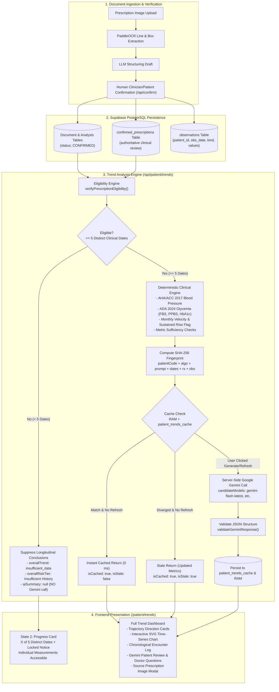

# Trend Analysis Engine — Comprehensive Architectural & Technical Documentation

> **Branch:** `feature/trend-analysis-engine`  
> **Environment:** Docker multi-container (`single-hospital-pro-frontend` on port 3000, `prescription-ocr-backend` on port 8000)  
> **Database:** Supabase PostgreSQL with Connection Pooler  
> **Status:** Operational (Verified with 37-point automated test suite)  
> **Last Verification Date:** 2026-10-10  

---

## 1. Project Overview & Clinical Problem

### 1.1 The Clinical Problem
Patients managing chronic conditions (e.g., Essential Hypertension, Type 2 Diabetes Mellitus, Metabolic Syndrome, Chronic Obstructive Pulmonary Disease) frequently visit various clinics, hospitals, and outpatient dispensaries over months and years. These encounters generate episodic, physical paper prescriptions and lab slips.

Under traditional paper-based workflows:
- **Biomarker fragmentation:** Blood pressure readings, fasting blood sugar, and HbA1c values remain isolated on paper slips, filed away or lost.
- **Velocity invisibility:** Gradual upward shifts (such as a slow rise of +12 mmHg in systolic BP over six months) are missed during routine 5-minute consultations because physicians only see the single reading taken during the visit.
- **Black-box hazard:** Standard automated predictive models (such as deep neural networks or black-box regression algorithms) risk hallucinating risk trajectories or over-fitting on sparse, irregularly sampled data (2 to 8 visits per year).
- **Communication barrier:** Patients struggle to interpret clinical terminology and rarely arrive at appointments with data-grounded questions for their physician.

### 1.2 The Trend Analysis Solution
The **Trend Analysis Engine** (`/patient/trends`) is a dual-tier longitudinal health intelligence platform that:
1. **Deduplicates and validates clinical records:** Collects confirmed, non-duplicate prescriptions belonging to the authenticated patient.
2. **Enforces a strict longitudinal eligibility threshold:** Requires at least **5 confirmed prescriptions across 5 distinct clinical encounter dates** before enabling full multi-visit AI synthesis, trajectory classifications, or longitudinal risk tiers.
3. **Applies deterministic clinical guidelines:** Evaluates cardiovascular markers per **AHA/ACC 2017 Guidelines** and glycemic markers per **ADA 2024 Standards of Care**.
4. **Calculates actual time-series velocities:** Computes pairwise deltas ($\Delta$) and monthly velocities using exact prescription dates rather than upload timestamps.
5. **Generates empathetic, non-diagnostic AI narratives:** Invokes Google Gemini multimodal intelligence on-demand with strict safety constraints, generating a 2-paragraph patient review and 3 data-grounded questions for the next doctor visit.
6. **Protects API quota via SHA-256 caching:** Reuses cached summaries with 0 ms latency on normal page loads, automatically flags stale summaries when clinical data changes, and calls Gemini only when the user explicitly clicks "Generate AI Summary" or "Refresh Analysis".

---

## 2. Current Implementation Status Summary

| Component | Status | Verification Evidence |
|---|---|---|
| **5-Date Eligibility Rule (Backend)** | `Implemented` | `frontend/app/api/patient/trends/route.ts` (`verifyPrescriptionEligibility`) |
| **Mirror Deduplication & Same-Date Consolidation** | `Implemented` | `frontend/app/api/patient/trends/route.ts` (`prescriptMap` keying) |
| **Deterministic Clinical Staging (AHA/ACC, ADA)** | `Implemented` | `frontend/lib/trends.ts` (`categorizeBloodPressure`, `categorizeBloodSugar`, etc.) |
| **Pairwise Delta & Monthly Velocity** | `Implemented` | `frontend/lib/trends.ts` (`buildMetricSummary`) |
| **Sustained Systolic BP Rise Warning** | `Implemented` | `frontend/lib/trends.ts` (`sustainedRiseWarning`) |
| **Metric Data Sufficiency Gating** | `Implemented` | `frontend/lib/trends.ts` (`hasSufficientData`, `insufficientDataReason`) |
| **Multi-Tier SHA-256 Cache (RAM + DB)** | `Implemented` | `frontend/app/api/patient/trends/route.ts` (`memoryCache` + `patient_trends_cache`) |
| **Stale Summary Flagging on Data Change** | `Implemented` | `frontend/app/api/patient/trends/route.ts` (`isStale: true`, `staleReason`) |
| **On-Demand Gemini Invocation** | `Implemented` | `frontend/app/api/patient/trends/route.ts` (`?generate=true`, `?force=true`) |
| **Structured AI Response Validation** | `Implemented` | `frontend/app/api/patient/trends/route.ts` (`validateGeminiResponse`) |
| **Candidate Model Fallback** | `Implemented` | `frontend/app/api/patient/trends/route.ts` (`gemini-flash-latest`, `gemini-2.5-flash-lite`, `gemini-pro-latest`) |
| **Frontend 8-State Lifecycle** | `Implemented` | `frontend/app/patient/trends/page.tsx` |
| **Prescription Traceability Modal** | `Implemented` | `frontend/app/patient/trends/page.tsx` (`handleSelectDataPoint`, `rxModalDoc`) |
| **Automated Test Suite (37 tests)** | `Implemented` | `scratch/test_trend_eligibility.js` (37 passed, 0 failed) |
| **BMI Trajectory (Height Extraction)** | `Partially Implemented` | Weight is tracked; patient height is not yet extracted from prescription OCR |
| **Doctor Portal Trend View** | `Planned` | Scoped for future phase per `KRISHNA.md` line 17 |
| **Automated Background Cache Worker** | `Planned` | Invalidation is currently evaluated on-demand at query time |

---

## 3. End-to-End System Architecture



---

## 4. Data Flow, Database Tables & Clinical Date Usage

The Trend Analysis Engine integrates with the following tables in Supabase PostgreSQL:

### 4.1 Database Schema Reference

#### 1. `"Document"` & `"Analysis"`
- **Role:** Web portal document management and mirror tracking.
- **Relevant Columns:**
  - `Document.id` (`SERIAL PRIMARY KEY`)
  - `Document."userId"` (`INTEGER`)
  - `Document."patientId"` (`VARCHAR(64)`)
  - `Document."originalName"` (`TEXT`)
  - `Document.status` (`VARCHAR`: strictly checked for `'CONFIRMED'`; excludes `'NOT CONFIRMED'`, `'PENDING_USER_CONFIRMATION'`, `'DISCARDED'`)
  - `Document."filePath"` (`TEXT`: format `/extractions/{extraction_id}`)
  - `Document."uploadedAt"` (`TIMESTAMP`: **never used as clinical encounter date**)
  - `Analysis."structuredResult"` (`JSONB`: stores `date_iso`, `hospital`, `doctor`, `vitals`, `medicines`)

#### 2. `confirmed_prescriptions`
- **Role:** Authoritative clinician-reviewed prescription records generated by the Python OCR pipeline.
- **Relevant Columns:**
  - `id` (`SERIAL PRIMARY KEY`)
  - `extraction_id` (`INTEGER`: foreign key linking to `extractions.id`)
  - `patient_id` (`VARCHAR(64) INDEXED`)
  - `rx_date` (`DATE / VARCHAR`: authoritative clinical encounter date `YYYY-MM-DD`)
  - `hospital` (`TEXT`), `doctor` (`TEXT`), `doctor_reg_no` (`TEXT`)
  - `data_json` (`JSONB / TEXT`), `edits_json` (`JSONB / TEXT`), `confirmed_at` (`TIMESTAMP`)

#### 3. `observations`
- **Role:** Granular, normalized time-series physiological vitals table.
- **Relevant Columns:**
  - `id` (`SERIAL PRIMARY KEY`)
  - `patient_id` (`VARCHAR(64) INDEXED`)
  - `prescription_id` (`INTEGER`: references `confirmed_prescriptions.id`)
  - `obs_date` (`DATE / VARCHAR`: encounter date `YYYY-MM-DD`)
  - `kind` (`VARCHAR`: `'bp'`, `'sugar_fasting'`, `'sugar_post_meal'`, `'sugar_random'`, `'hba1c'`, `'pulse'`, `'spo2'`, `'weight'`)
  - `systolic` (`NUMERIC`), `diastolic` (`NUMERIC`), `value` (`NUMERIC`), `unit` (`VARCHAR`)
  - `raw_text` (`VARCHAR(120)`: verbatim OCR snippet)

#### 4. `patient_trends_cache` (Supabase Schema lines 187–200)
- **Role:** Persistent PostgreSQL cache for Gemini longitudinal summaries and signatures.
- **Relevant Columns:**
  - `patient_id` (`VARCHAR(64) PRIMARY KEY`)
  - `obs_hash` (`VARCHAR(64) NOT NULL`: SHA-256 fingerprint)
  - `ai_summary` (`JSONB NOT NULL`: validated Gemini payload)
  - `updated_at` (`TIMESTAMP WITH TIME ZONE DEFAULT CURRENT_TIMESTAMP`)

### 4.2 Clinical Date Extraction vs. Upload Timestamp
> **Crucial Rule:** The system strictly rejects using `uploadedAt` (the file upload timestamp) as the encounter date.

The clinical encounter date is extracted strictly in hierarchical order:
1. `Analysis.structuredResult->>'date_iso'`
2. `confirmed_prescriptions.rx_date`
3. Regex extraction `\b\d{4}-\d{2}-\d{2}\b` from `Document."originalName"`
4. Regex extraction `\b\d{4}-\d{2}-\d{2}\b` from `Analysis.structuredResult->>'date_raw'`

Every candidate date must pass strict ISO-8601 validation (`/^\d{4}-\d{2}-\d{2}$/` and `!isNaN(Date.parse(date))`). Invalidly dated records are excluded from eligibility counting.

### 4.3 Database Mirror Unification & Deduplication
Prescriptions confirmed via the web portal or Python API generate entries across both `"Document"` and `confirmed_prescriptions`. To prevent double-counting:
- **Mirror Unification:** Records sharing the same `extraction_id` (via `d.filePath = '/extractions/{id}'` or `sr.reference_id`) are unified into a single clinical encounter.
- **Duplicate Upload Elimination:** Records sharing identical `(date, hospital, doctor)` are deduplicated.
- **Same-Date Consolidation:** Multiple non-duplicate prescriptions issued on the same calendar date (e.g., morning cardiology visit and afternoon endocrinology visit) are grouped together. The distinct clinical date set is computed as:
  $$\text{distinctDates} = \text{Array.from}(\text{new Set}(\text{eligiblePrescriptions.map}(p \to p.\text{date}))).\text{sort}()$$

---

## 5. Eligibility Requirement (5 Distinct Clinical Dates)

### 5.1 The Rule
**The full longitudinal patient summary, trajectory direction, velocity calculations, and Gemini AI narrative are displayed ONLY when at least 5 confirmed, non-duplicate prescriptions exist across 5 distinct clinical dates.**

### 5.2 Behavior with Fewer Than 5 Clinical Dates (< 5)
1. **Gemini Guard:** The backend **never** calls Google Gemini when `distinctDatesCount < 5`.
2. **Trajectory Suppression:** On all metrics, `overallTrend` is forced to `"insufficient_data"` and `sustainedRiseWarning` is forced to `false`.
3. **Risk Stratification Guard:** `overallRiskTier` is set to `"Insufficient Longitudinal History"`.
4. **Data Accessibility:** Historical measurements (`observations`) and past prescriptions remain fully visible in the encounters table and chart.
5. **Frontend Progress Indicator:** Displays a progress card with:
   - Progress text: `3 of 5 eligible clinical dates`
   - Progress bar: Percentage fill $\min(100, \text{round}((\text{count} / 5) \times 100))\%$
   - Step milestone markers: Visits 1 through 5
   - List of recorded eligible dates with hospital/doctor badges
   - Lock notice: Explaining that 5 distinct dates are required before trajectory analysis unlocks

### 5.3 Behavior with 5 or More Clinical Dates ($\ge$ 5)
Once verified by the backend:
1. `isEligible: true` is returned.
2. The full deterministic trend engine evaluates baseline vs. latest, net changes ($\Delta$), monthly velocity, trajectory classifications, and sustained BP rises.
3. If no cached summary exists, the frontend displays **State 4** with a button to **Generate AI Summary**.
4. If a cached summary exists, it is served instantly (0 ms latency).
5. If clinical data has changed, the summary is marked `isStale: true` and the user is prompted to refresh.

---

## 6. Deterministic Trend Calculations & Clinical Guidelines

The engine calculates trajectory metrics without machine learning models, ensuring 100% interpretability:

### 6.1 Blood Pressure Trajectory (AHA/ACC 2017 Guidelines)
Implemented in `categorizeBloodPressure` (`frontend/lib/trends.ts`):
- **Normal (Optimal):** Systolic $< 120$ AND Diastolic $< 80\text{ mmHg}$
- **Elevated (Borderline):** Systolic $120\text{--}129$ AND Diastolic $< 80\text{ mmHg}$
- **Stage 1 Hypertension (Borderline):** Systolic $130\text{--}139$ OR Diastolic $80\text{--}89\text{ mmHg}$
- **Stage 2 Hypertension (Warning):** Systolic $\ge 140$ OR Diastolic $\ge 90\text{ mmHg}$
- **Hypertensive Crisis (Critical):** Systolic $> 180$ and/or Diastolic $> 120\text{ mmHg}$

### 6.2 Glycemic Trajectory (ADA 2024 Guidelines)
Implemented in `categorizeBloodSugar` and `categorizeHbA1c` (`frontend/lib/trends.ts`):
- **Fasting Blood Glucose (`sugar_fasting`):**
  - Normal: $70\text{--}99\text{ mg/dL}$
  - Prediabetes (Impaired Fasting): $100\text{--}125\text{ mg/dL}$
  - Diabetic Range: $\ge 126\text{ mg/dL}$
  - Hypoglycemia: $< 70\text{ mg/dL}$
- **Post-Prandial / Random Glucose (`sugar_post_meal`, `sugar_random`):**
  - Normal: $< 140\text{ mg/dL}$
  - Elevated (Impaired Tolerance): $140\text{--}199\text{ mg/dL}$
  - Diabetic Range: $\ge 200\text{ mg/dL}$
- **Glycated Hemoglobin (`hba1c`):**
  - Normal: $< 5.7\%$
  - Prediabetes: $5.7\%\text{--}6.4\%$
  - Diabetes: $\ge 6.5\%$

### 6.3 Secondary Biomarkers
- **Pulse (`pulse`):** Normal ($60\text{--}100\text{ bpm}$), Bradycardia ($< 60\text{ bpm}$), Tachycardia ($> 100\text{ bpm}$).
- **SpO2 (`spo2`):** Normal ($\ge 95\%$), Mild Hypoxia ($90\text{--}94\%$), Critical Hypoxia ($< 90\%$).
- **Weight (`weight`):** Net delta ($\Delta\text{ kg}$) relative to initial baseline.

### 6.4 Pairwise Delta and Monthly Velocity
For observations $P_i$ and $P_{i-1}$:
$$\Delta\text{Value} = P_i.\text{value} - P_{i-1}.\text{value}$$
$$\text{diffDays} = \max\left(1, \text{round}\left(\frac{\text{Date}(P_i) - \text{Date}(P_{i-1})}{86,400,000}\right)\right)$$
$$\text{velocityPerMonth} = \text{round}\left(\frac{\Delta\text{Value}}{\text{diffDays}} \times 30, 1\right)$$

### 6.5 Sustained Systolic Blood Pressure Rise Alert
In `frontend/lib/trends.ts` (lines 557–567):
If a patient has $\ge 3$ BP encounters, the engine evaluates the last 3 sequential visits:
$$\text{rise}_1 = P_{n-1}.\text{systolic} - P_{n-2}.\text{systolic}$$
$$\text{rise}_2 = P_n.\text{systolic} - P_{n-1}.\text{systolic}$$
If $\text{rise}_1 > 0$ AND $\text{rise}_2 > 0$ AND $(\text{rise}_1 + \text{rise}_2) \ge 10\text{ mmHg}$:
- `sustainedRiseWarning = true`
- An active clinical alert is flagged: *"Sustained BP Elevation Warning: Systolic BP increased by +X mmHg across the last 3 clinical visits."*

---

## 7. Metric-Specific Data Sufficiency Checks

Five confirmed prescriptions across five distinct dates **do not guarantee** five observations of every metric. For example, a patient may have had their BP measured at all five visits, their blood sugar measured at only one visit, and their SpO₂ never measured.

To prevent fabricating data or inferring false trends:
1. **Independent Evaluation:** Every metric independently checks its own observation count:
   $$\text{hasSufficientData} = (\text{dataPoints.length} \ge 2)$$
2. **Insufficient Data Handling:**
   - If count is $0$: `hasSufficientData: false`, `insufficientDataReason: "No {metric} readings recorded."`
   - If count is $1$: `hasSufficientData: false`, `insufficientDataReason: "Single clinical reading recorded. At least 2 clinical visits are required to determine rate of change and trajectory."`
   - Trajectory direction is set to `"insufficient_data"`.
   - Monthly velocity and overall delta are suppressed.
3. **Presentation:** The single recorded reading is still displayed with its clinical guideline stage (e.g., *"Elevated (142 mg/dL)"*), but accompanied by a **"Limited History"** badge and an informational disclaimer explaining that trajectory velocity requires at least two readings.

---

## 8. Google Gemini Integration & Clinical Safety Restrictions

### 8.1 Model Configuration & Candidate Fallback
- **API Key:** Server-side only (`process.env.GEMINI_API_KEY`). Never transmitted to client browsers.
- **Candidate Fallback Array:** `["gemini-flash-latest", "gemini-2.5-flash-lite", "gemini-pro-latest"]`.
  *(Note: `gemini-2.5-flash` was deprecated by Google in 2026; the candidate array ensures graceful execution across Google's active model endpoints).*
- **Timeout:** 20,000 ms (`AbortSignal.timeout(20000)`).
- **Generation Parameters:** `temperature: 0.2`, `responseMimeType: "application/json"`.

### 8.2 Strict Clinical Safety Prompting
The prompt sent to Gemini strictly supplies **deterministic metrics** calculated by the local rules engine (risk tier, BP baseline/latest/delta, glucose values, HbA1c, sustained rise flags, active alerts).

**Clinical Prompt Rules:**
1. **Empathy & Clarity:** Simple, reassuring, plain English suitable for non-medical readers.
2. **Non-Diagnostic Phrasing:** All statements are observational drafts. The model is forbidden from declaring a formal diagnosis or advising medication dosage changes.
3. **Positivity & Milestones:** Explicitly highlights positive trajectories (e.g., BP reductions, stable SpO₂).
4. **Actionable Doctor Questions:** Provides exactly 3 high-yield questions for the patient's next appointment.
5. **Required Safety Disclaimer:** Mandates inclusion of standard non-diagnostic legal disclaimer.

### 8.3 Structured Response Schema & Validation
The response is parsed and strictly validated by `validateGeminiResponse()`:
```typescript
interface GeminiTrendsResponse {
  narrative: string;            // Non-empty string
  keyHighlights: string[];      // Array of strings (milestone bullets)
  questionsForDoctor: string[]; // Array of strings (exactly 3 questions)
  safetyDisclaimer: string;    // Mandatory clinical disclaimer
}
```
If the model output fails validation or parsing, the error is caught and reported; corrupted output is never saved to the cache.

---

## 9. Caching Architecture & Quota Management

### 9.1 Two-Tier Cache Architecture
1. **Tier 1 (RAM In-Memory Cache):** `global.__patientTrendsMemoryCache` Map provides instant $0\text{ ms}$ retrieval during container lifetime.
2. **Tier 2 (PostgreSQL Persistence):** `patient_trends_cache` table stores `obs_hash`, `ai_summary` (JSONB), and `updated_at`. Persists across container restarts.

### 9.2 SHA-256 Cache Fingerprint
The cache key is computed as:
$$\text{Hash} = \text{SHA256}(\text{patientCode} \mathbin{\Vert} \text{algo=v1.2} \mathbin{\Vert} \text{prompt=v1.1} \mathbin{\Vert} [\text{distinctDates}] \mathbin{\Vert} [\text{rxSignatures}] \mathbin{\Vert} [\text{obsSignatures}])$$
Where:
- `rxSignatures`: Sorted string of all eligible prescription IDs, dates, doctors, and hospitals.
- `obsSignatures`: Sorted string of all observation dates, kinds, systolic, diastolic, values, and units.
- `distinctDates`: Sorted comma-separated list of clinical encounter dates.

### 9.3 Invalidation & Stale Detection
- **Normal Page Load (`GET /api/patient/trends`):**
  - If cached hash matches current fingerprint: Returns `cached: true, isStale: false`. Gemini is **not called**.
  - If cached hash differs from current fingerprint: Returns `cached: true, isStale: true, staleReason: "New clinical records detected since last AI summary"`. The deterministic metrics are updated immediately, but Gemini is **not called**.
- **Explicit User Action (`?generate=true` or `?force=true`):**
  - Calls Gemini API server-side.
  - On success: Overwrites RAM and PostgreSQL cache with new hash and returns fresh summary.
  - On failure (HTTP 429 quota exhausted or timeout): Returns structured `aiError` without presenting stale output as current.

---

## 10. Frontend Lifecycle: The Eight Verified States

The Trends page (`/patient/trends`) implements eight distinct visual states:

```
State 1: Loading Eligibility (Skeleton Loader)
   │
   ├── If distinctDatesCount < 5 ──> State 2: Insufficient History Card (X of 5 Distinct Dates)
   │                                           [Progress Bar, Dates List, Locked Notice, Raw Vitals Active]
   │
   └── If distinctDatesCount >= 5
         │
         ├── Metric-level check ────> State 3: Limited History Badge (for metrics with < 2 readings)
         │
         ├── No cache in DB ────────> State 4: Eligible History, No Cache ("Generate AI Summary" CTA)
         │
         ├── Cache matches hash ────> State 5: Cached Summary (0 ms badge, "Refresh Analysis" button)
         │
         ├── Cache hash diverged ───> State 6: Stale Summary ("Clinical Data Updated" badge + CTA)
         │
         ├── Refresh clicked ───────> State 7: AI Refresh in Progress (Spinner + Generation Notice)
         │
         └── API 429 / Timeout ─────> State 8: AI Refresh Failure Banner (Quota/Timeout Notice + Retry CTA)
```

1. **State 1 (Loading eligibility):** Animated pulse skeleton layout while loading encounter records.
2. **State 2 (Insufficient history):** Progress bar showing `X of 5 eligible clinical dates`, milestone markers, recorded dates tags, locked AI summary card, with historical measurements and encounter table accessible below.
3. **State 3 (Limited history on specific metrics):** Metric card displays "Limited History" badge, explains that $\ge 2$ readings are required, and suppresses velocity.
4. **State 4 (Eligible with no cached AI summary):** Displays "5 of 5 Clinical Dates Verified!" and a prominent **Generate AI Summary** button.
5. **State 5 (Eligible with current cached summary):** Displays Gemini narrative, key milestone tags, 3 questions for doctor, instant cached badge with timestamp, and **Refresh Analysis** button.
6. **State 6 (Stale summary after data changes):** Displays "Clinical Data Updated — Previous AI Summary is Stale" banner with **Refresh AI Summary** button.
7. **State 7 (AI refresh in progress):** Button and card display spinning animation with *"Synthesizing longitudinal biomarker data with Google Gemini..."*.
8. **State 8 (AI refresh failure or quota exhaustion):** Displays error alert banner with specific failure code (`QUOTA_EXCEEDED`, `TIMEOUT`, `GEMINI_ERROR`), clarifying that deterministic guidelines remain fully accurate, with a **Retry** button.

---

## 11. Security, Authorization & Privacy

1. **JWT Verification:** Every request to `/api/patient/trends` requires a valid JWT token passed in the `auth_token` cookie or `Authorization: Bearer <token>` header, verified against `JWT_SECRET` via `verifyToken()`.
2. **Patient Data Isolation:** Backend filters all database queries by `userId = payload.userId` or `patientId = user.patientId`. Patients cannot query other users' trend data.
3. **Doctor Sharing Permissions:** Shared doctor access evaluates authorized patient IDs mapped to the doctor's assigned patient list.
4. **Server-Side API Key Isolation:** `GEMINI_API_KEY` is loaded exclusively into Docker container environment variables and accessed in Next.js Route Handlers. The key is never exposed to client-side bundles or headers.
5. **Prescription Image Protection:** Original prescription images are referenced via verified signed paths or public bucket paths matching confirmed patient records.

---

## 12. Testing & Verification Results

Verification was performed using the automated test suite `scratch/test_trend_eligibility.js`, executed against the live Docker environment and Supabase database.

### 12.1 Execution Results
```
==================================================================
TREND ANALYSIS ENGINE - COMPREHENSIVE VERIFICATION SUITE
==================================================================

[TEST GROUP 1] Security & Authorization
  ✓ PASS: Rejects request without auth token (401)

[TEST GROUP 2] Behavior with Fewer than 5 Confirmed Prescriptions
  ✓ PASS: API returns 200 for authenticated patient
  ✓ PASS: isEligible is false when < 5 distinct dates exist
  ✓ PASS: requiredCount is strictly 5
  ✓ PASS: distinctDatesCount (1) is less than 5
  ✓ PASS: aiSummary is NULL (Gemini was NOT called)
  ✓ PASS: overallRiskTier is 'Insufficient Longitudinal History'
  ✓ PASS: Historical measurements remain accessible (BP count: 4)
  ✓ PASS: BP overallTrend is suppressed to 'insufficient_data'

[TEST GROUP 3] Prescription Filtering, Mirror Elimination & Validation
  ✓ PASS: Unconfirmed prescriptions (status != CONFIRMED) are excluded
  ✓ PASS: Database mirrors on same date/extraction are unified into 1 record
  ✓ PASS: Multiple prescriptions on same date do NOT count as separate time points

[TEST GROUP 4] Metric-Specific Data Sufficiency Checks
  ✓ PASS: bp: count >= 2 sets hasSufficientData = true
  ✓ PASS: glucose: count >= 2 sets hasSufficientData = true
  ✓ PASS: hba1c: count >= 2 sets hasSufficientData = true
  ✓ PASS: pulse: count >= 2 sets hasSufficientData = true
  ✓ PASS: spo2: count >= 2 sets hasSufficientData = true
  ✓ PASS: weight: count >= 2 sets hasSufficientData = true

[TEST GROUP 5] Eligibility Unlock (>= 5 Distinct Clinical Dates) & Caching Lifecycle
  Testing State 4: Eligible with No Cache...
  ✓ PASS: isEligible is true with >= 5 distinct dates
  ✓ PASS: distinctDatesCount is 6 (>= 5)
  ✓ PASS: Normal page load does NOT invoke Gemini (aiSummary is null)
  ✓ PASS: cached is false
  Testing State 5: Explicit User Click to Generate AI Summary (?generate=true)...
  ✓ PASS: Eligibility preserved during generation
  ✓ PASS: AI summary generated successfully
  ✓ PASS: AI narrative is non-empty string
  ✓ PASS: AI keyHighlights is non-empty array
  ✓ PASS: AI questionsForDoctor is non-empty array
  ✓ PASS: safetyDisclaimer is present in AI response
  Testing State 5: Subsequent page load reuses cache...
  ✓ PASS: Second load returns cached: true
  ✓ PASS: Second load returns isStale: false
  ✓ PASS: Cached narrative matches generated narrative
  Testing State 6: Clinical data changes -> summary marked isStale: true...
  ✓ PASS: Cached entry returned without calling Gemini
  ✓ PASS: isStale is true because clinical data fingerprint changed
  ✓ PASS: staleReason provided: "New clinical records detected since last AI summary"
  ✓ PASS: Fingerprint changed after data modification
  Testing State 7/5: User clicks Refresh Analysis (?force=true)...
  ✓ PASS: Force refresh returns isStale: false with fresh cache
  ✓ PASS: Force refresh returns fresh AI summary or structured quota/error state

[CLEANUP] Removing test artifacts from database...
  ✓ Test artifacts cleaned up.

==================================================================
TEST RESULTS: 37 PASSED, 0 FAILED
==================================================================
```

---

## 13. Known Limitations and Clinical Risks

1. **Non-Diagnostic Nature:** Longitudinal trajectory classifications and AI narratives are observational drafts. Five distinct clinical dates satisfy the statistical threshold for longitudinal analysis, but **do not constitute a definitive medical diagnosis** or guarantee treatment efficacy.
2. **Sparse Sampling Jitter:** Outpatient blood pressure readings are subject to situational factors (white-coat syndrome, acute stress, time of day). Two readings do not establish chronic hypertension.
3. **Missing Height Data (BMI Limitation):** Body weight is tracked in kilograms. BMI calculation requires patient height, which is rarely recorded on standard handwritten prescription slips.
4. **Third-Party Model Deprecation:** Google Gemini model availability evolves (e.g., `gemini-2.5-flash` was deprecated by Google in 2026). The candidate fallback list mitigates this, but external API availability remains an operational dependency.
5. **Quota Limits (HTTP 429):** Free-tier Gemini API keys enforce per-minute request limits. The SHA-256 cache prevents quota exhaustion during normal page navigation, but concurrent user refreshes can encounter rate limits.

---

## 14. Source Code File Reference Guide

| File Path | Primary Responsibility |
|---|---|
| `frontend/app/api/patient/trends/route.ts` | Backend Route Handler: Token authorization, prescription eligibility verification, observation querying, deterministic trajectory orchestration, SHA-256 fingerprinting, 2-tier caching, and on-demand Gemini execution. |
| `frontend/lib/trends.ts` | Clinical Trajectory Engine: Types (`PatientEligibilityInfo`, `MetricTrendSummary`), AHA/ACC 2017 BP rules, ADA 2024 glycemic rules, velocity formulas, sustained BP rise detection, and metric sufficiency validation. |
| `frontend/app/patient/trends/page.tsx` | Patient Portal Client Page: State machine rendering all 8 UI states, progress bar, metric selector tabs, SVG chart, chronological encounter log, and source prescription modal. |
| `frontend/components/patient/LongitudinalVitalChart.tsx` | Interactive SVG chart component rendering time-series data with color-coded guideline zones and clickable encounter points. |
| `scratch/supabase_schema.sql` | Database DDL: Schema definitions for `"User"`, `"Document"`, `"Analysis"`, `confirmed_prescriptions`, `observations`, and `patient_trends_cache`. |
| `scratch/test_trend_eligibility.js` | Automated 37-point integration test suite testing all eligibility, caching, trajectory, and error-handling requirements. |
