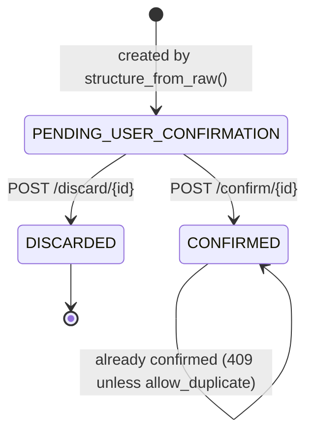

# 04 — Data Model

## Entity-Relationship Diagram

```mermaid
erDiagram
    raw_ocr {
        int id PK
        varchar image_sha256
        varchar patient_id
        varchar filename
        varchar ocr_engine
        int image_w
        int image_h
        float avg_conf
        text lines_json
        varchar created_at
    }
    extractions {
        int id PK
        int raw_ocr_id FK
        varchar llm_model
        text analysis_json
        varchar status
        varchar created_at
    }
    confirmed_prescriptions {
        int id PK
        int extraction_id FK_UNIQUE
        varchar patient_id
        varchar rx_date
        varchar hospital
        varchar doctor
        varchar doctor_reg_no
        text data_json
        text edits_json
        varchar confirmed_by
        varchar confirmed_at
    }
    observations {
        int id PK
        varchar patient_id
        int prescription_id FK
        varchar obs_date
        varchar kind
        float systolic
        float diastolic
        float value
        varchar unit
        varchar raw_text
        varchar created_at
    }
    medicine_master {
        int id PK
        varchar name
        varchar generic
        text composition
        text uses
        varchar strengths_mg
        varchar source
    }
    audit_log {
        int id PK
        varchar ts
        varchar event
        int extraction_id
        text detail
    }
    User {
        int id PK
        varchar patientId
        varchar legacyPatientId
        varchar name
        varchar email
        varchar passwordHash
        varchar createdAt
    }
    Document {
        int id PK
        int userId FK
        varchar patientId
        varchar originalName
        varchar storedFilename
        varchar documentType
        varchar mimeType
        varchar filePath
        varchar status
        varchar uploadedAt
    }
    Analysis {
        int id PK
        int documentId FK
        text summary
        jsonb structuredResult
        bool isDemo
        varchar createdAt
    }
    patient_medications {
        int id PK
        varchar patient_id
        int user_id
        int prescription_id FK
        int document_id FK
        varchar name
        varchar normalized_name
        varchar strength
        varchar status
        varchar indication
        varchar frequency
        varchar route
        varchar prescription_date
        varchar start_date
        varchar duration_raw
        int duration_days
        varchar expected_end_date
        varchar actual_end_date
        text discontinued_reason
        text status_reason
        varchar doctor
        varchar reference_id
        varchar reconciliation_category
        text reconciliation_notes
        bool is_conflicting
        text conflict_details
        varchar source
        varchar reliability
        varchar verification_status
    }
    patient_medication_audit {
        int id PK
        int medication_id FK
        varchar patient_id
        int user_id
        varchar action
        varchar previous_status
        varchar new_status
        text reason
        varchar actor
        timestamp created_at
    }
    patient_trend_cache {
        int id PK
        varchar patient_id
        varchar cache_key
        text data_hash
        jsonb payload
        varchar expires_at
        timestamp created_at
    }

    raw_ocr ||--o{ extractions : "raw_ocr_id"
    extractions ||--o| confirmed_prescriptions : "extraction_id (unique)"
    confirmed_prescriptions ||--o{ observations : "prescription_id"
    User ||--o{ Document : "userId"
    Document ||--o{ Analysis : "documentId"
    User ||--o{ patient_medications : "user_id"
    patient_medications ||--o{ patient_medication_audit : "medication_id"
```

---

## Python Service Tables (SQLAlchemy — snake_case)

### `raw_ocr`

Stores the output of PaddleOCR for each uploaded image, before any LLM call.

| Column | Type | Constraint | Purpose |
|---|---|---|---|
| `id` | Integer | PK, autoincrement | Row ID |
| `image_sha256` | String(64) | Indexed | SHA-256 of the raw uploaded bytes — used for deduplication |
| `patient_id` | String(64) | Indexed | Patient UHID or 9-digit ID provided at upload |
| `filename` | String(255) | — | Original filename |
| `ocr_engine` | String(64) | — | `"PaddleOCR"` or `"PaddleOCR-VL"` |
| `image_w` | Integer | — | Preprocessed image width (pixels) |
| `image_h` | Integer | — | Preprocessed image height (pixels) |
| `avg_conf` | Float | — | Average confidence of all detected lines |
| `lines_json` | Text | — | JSON array of `{id, row, text, conf, x, y}` line dicts |
| `created_at` | String(32) | — | ISO 8601 UTC timestamp |

### `extractions`

Stores the LLM structuring result and quality gate output, as a draft for human review.

| Column | Type | Constraint | Purpose |
|---|---|---|---|
| `id` | Integer | PK, autoincrement | Row ID |
| `raw_ocr_id` | Integer | Indexed → `raw_ocr.id` | Link to source raw OCR |
| `llm_model` | String(64) | — | Gemini model name that produced this extraction |
| `analysis_json` | Text | — | JSON: `{record: {...}, gate: {status, reasons}, warnings: [...]}` |
| `status` | String(32) | Indexed | `PENDING_USER_CONFIRMATION` \| `CONFIRMED` \| `DISCARDED` |
| `created_at` | String(32) | — | ISO 8601 UTC timestamp |

**Status state machine:**



### `confirmed_prescriptions`

The final human-confirmed record. This is the authoritative source for patient prescription history.

| Column | Type | Constraint | Purpose |
|---|---|---|---|
| `id` | Integer | PK, autoincrement | Row ID |
| `extraction_id` | Integer | Unique → `extractions.id` | Link to the draft extraction |
| `patient_id` | String(64) | Indexed | Patient UHID |
| `rx_date` | String(10) | Indexed | Prescription date `YYYY-MM-DD` |
| `hospital` | String(255) | — | Hospital name |
| `doctor` | String(255) | — | Doctor name |
| `doctor_reg_no` | String(64) | — | Doctor registration number |
| `data_json` | Text | — | Full confirmed record JSON (same shape as `record` in `analysis_json`) |
| `edits_json` | Text | — | JSON array of `{path, machine, confirmed}` diffs |
| `confirmed_by` | String(64) | — | Name or ID of confirming user |
| `confirmed_at` | String(32) | — | ISO 8601 UTC timestamp |

### `observations`

Numeric vital signs extracted at confirmation time, for trend charting.

| Column | Type | Constraint | Purpose |
|---|---|---|---|
| `id` | Integer | PK, autoincrement | Row ID |
| `patient_id` | String(64) | Indexed | Patient UHID |
| `prescription_id` | Integer | Indexed → `confirmed_prescriptions.id` | Source prescription |
| `obs_date` | String(10) | Indexed | Date of observation `YYYY-MM-DD` |
| `kind` | String(24) | Indexed | `bp` \| `sugar_fasting` \| `sugar_post_meal` \| `sugar_random` \| `sugar_unspecified` \| `hba1c` \| `pulse` \| `temp` \| `spo2` \| `weight` |
| `systolic` | Float | — | Systolic BP (mmHg), null for non-BP kinds |
| `diastolic` | Float | — | Diastolic BP (mmHg), null for non-BP kinds |
| `value` | Float | — | Numeric value for non-BP kinds |
| `unit` | String(16) | — | `mmHg`, `mg/dL`, `mmol/L`, `%`, `/min`, `F`, `C`, `kg` |
| `raw_text` | String(120) | — | Original text string (e.g. `"BP 130/80 mmHg"`) |
| `created_at` | String(32) | — | ISO 8601 UTC timestamp |

### `medicine_master`

The medicine knowledge base used for drug name lookup and verification.

| Column | Type | Constraint | Purpose |
|---|---|---|---|
| `id` | Integer | PK, autoincrement | Row ID |
| `name` | String(120) | Unique | Brand or generic name, lowercase |
| `generic` | String(160) | — | Generic (INN) name |
| `composition` | Text | — | Active ingredient composition string |
| `uses` | Text | — | Indication or therapeutic class |
| `strengths_mg` | String(200) | — | Comma-separated known strengths e.g. `"250,500,850"` (blank if unknown) |
| `source` | String(80) | — | Data provenance: `"starter_seed"`, `"csv_import"`, etc. |

> The `load_med_index()` function also supports an extended schema with columns `brand_name`, `generic_name`, `composition_raw`, `active_ingredients`, `strength_text`, `therapeutic_class` (for bulk-imported datasets). The column mapping is handled with fallbacks.

### `audit_log`

Append-only event log for the pipeline.

| Column | Type | Constraint | Purpose |
|---|---|---|---|
| `id` | Integer | PK, autoincrement | Row ID |
| `ts` | String(32) | — | ISO 8601 UTC timestamp |
| `event` | String(40) | — | `ocr_saved` \| `extracted` \| `confirmed` \| `discarded` \| `llm_failed` |
| `extraction_id` | Integer | — | Related extraction (null for `ocr_saved`) |
| `detail` | Text | — | JSON detail object |

---

## Next.js EHR & Patient Tables (pg pool — PostgreSQL)

Managed by `frontend/lib/db.ts` and API endpoints.

| Table | Purpose |
|---|---|
| `"User"` | Patient accounts: `id`, `patientId` (9-digit), `legacyPatientId`, `name`, `email`, `passwordHash`, `createdAt` |
| `"Document"` | Uploaded prescription records: `id`, `userId`, `patientId`, `originalName`, `storedFilename` (stores public Supabase Storage CDN URL or local fallback path), `documentType` (`PRESCRIPTION`), `mimeType`, `filePath` (`/extractions/<id>`), `status` (`NOT CONFIRMED` \| `CONFIRMED` \| `DISCARDED`), `uploadedAt` |
| `"Analysis"` | Structured analysis linked to document: `id`, `documentId`, `summary`, `structuredResult` (JSONB containing full extraction record and `image_url`), `isDemo`, `createdAt` |
| `patient_onboarding` | Patient baseline health context: `id`, `user_id`, `patient_id`, `basic_info` (JSONB), `conditions` (JSONB), `custom_conditions` (JSONB), `history` (JSONB), `is_completed`, `created_at`, `updated_at` |
| `patient_medications` | Recorded patient medications with generalized lifecycle management: `id`, `patient_id`, `user_id`, `prescription_id`, `document_id`, `name`, `normalized_name`, `strength`, `status` (`ACTIVE` \| `COMPLETED` \| `ON_HOLD` \| `DISCONTINUED` \| `NEEDS_REVIEW`), `indication`, `frequency`, `route`, `prescription_date`, `uploaded_at`, `start_date`, `duration_raw`, `duration_days`, `expected_end_date`, `actual_end_date`, `discontinued_reason`, `status_reason`, `doctor`, `reference_id`, `reconciliation_category` (`NEW_COURSE` \| `POSSIBLE_CONTINUATION` \| `CHANGE_IN_STRENGTH_OR_INSTRUCTIONS` \| `OVERLAPPING_TREATMENT` \| `CONFLICTING_INSTRUCTIONS` \| `POTENTIAL_DUPLICATE` \| `INSUFFICIENT_INFORMATION`), `reconciliation_notes`, `is_conflicting`, `conflict_details`, `source`, `reliability`, `verification_status`, `created_at`, `updated_at` |
| `patient_medication_audit` | Immutable clinical audit trail for medication lifecycle transitions: `id`, `medication_id`, `patient_id`, `user_id`, `action` (`STATUS_CHANGE` \| `RECONCILE_CONFIRM`), `previous_status`, `new_status`, `reason`, `actor` (`Patient` \| `Clinician`), `created_at` |
| `patient_trend_cache` | Dual-tier hash cache for longitudinal statistical summaries and Gemini AI narrative outputs: `id`, `patient_id`, `cache_key`, `data_hash` (SHA-256 of deduplicated observation values), `payload` (JSONB cache entry), `expires_at`, `created_at` |
| `patient_timeline` | Medical timeline events & symptoms: `id`, `patient_id`, `user_id`, `event_date`, `category`, `title`, `description`, `source`, `facility`, `is_conflicting`, `created_at` |

> Row-Level Security (RLS) is enabled on all tables in Supabase. Policies grant full access via the service role. See `scratch/supabase_schema.sql` for the exact policy definitions.

---

## Pydantic Output Schema

These Pydantic models define the JSON contract between the LLM and the validation layer.

**`Val`** — every extracted field value:
```python
class Val(BaseModel):
    value: Optional[str] = None   # text exactly as OCR read it; null if absent
    src: List[str] = []           # OCR line IDs this value was read from
```

**`Medicine`**:
```python
class Medicine(BaseModel):
    name: Val; form: Val; strength: Val; dose: Val
    frequency: Val; timing: Val; duration: Val; route: Val
    ambiguity_note: Optional[str] = None
```

**`Prescription`** — top-level extraction:
```python
class Prescription(BaseModel):
    looks_like_prescription: bool = True
    hospital_name: Val; doctor_name: Val; doctor_reg_no: Val
    patient_name: Val; patient_uhid: Val; patient_age: Val
    patient_sex: Val; patient_ward_bed: Val; date: Val
    vitals: List[Vital]; diagnosis: List[Val]
    allergies: List[Val]; medicines: List[Medicine]
    advice: List[Val]; follow_up: Val
```

---

## Provenance Chain

Every fact in a confirmed prescription traces back to the original image:

```
confirmed_prescriptions.id
  └── extractions.id  (via extraction_id)
        └── raw_ocr.id  (via raw_ocr_id)
              └── lines_json[i].src → OCR line IDs ["L04", "L05"]
                    └── raw_ocr.image_sha256 → original uploaded image
```

The `edits_json` column records exactly what the clinician changed from the machine output, preserving a diff of human corrections.

---

## Migration Approach

The Python service calls `md_.create_all(engine)` at startup — tables are created if they do not exist (idempotent). No migration framework is used.

**To change the schema safely:**
1. Update the `Table(...)` definition in `model/final_prescription_ocr_service_windows.py`.
2. If adding a column: add an `ALTER TABLE ... ADD COLUMN IF NOT EXISTS ...` statement to `scratch/supabase_schema.sql`.
3. If changing an existing column or constraint: write explicit `ALTER TABLE` SQL and test on a non-production database first.
4. Update this document.
5. Add a `CHANGELOG.md` entry.

---

## PLANNED — Future Tables

| Table | Purpose | Status |
|---|---|---|
| `medicines` | Normalised drug master with `brand_name`, `form`, `manufacturer` | PLANNED |
| `ingredients` | Active salt mapping: `drug_id`, `salt_name`, `atc_code`, `strength_text` | PLANNED |
| `medicine_aliases` | OCR error aliases, brand variants | PLANNED |
| `medicine_ingredients` | Many-to-many: `medicine_id`, `ingredient_id`, `strength_mg` | PLANNED |
