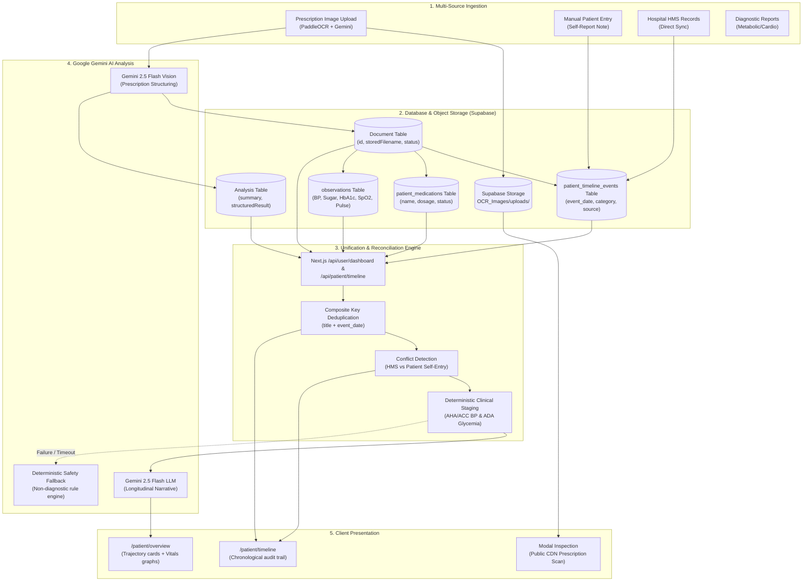

# 15 — Medical Timeline & AI Summary Engine: Complete Architectural Analysis

## Overview

The **Medical Timeline & Clinical AI Engine** in `Single-Hospital-Pro` is a dual-tier longitudinal health intelligence system. It aggregates clinical encounters from multiple heterogeneous sources (OCR-scanned prescriptions, hospital HMS sync, diagnostic lab tests, and manual patient notes), resolves conflicts, organizes events chronologically, and applies **Google Gemini multimodal vision & LLM intelligence** combined with deterministic clinical guidelines to generate patient-facing longitudinal health narratives.

---

## 1. High-Level Architecture & End-to-End Flow



---

## 2. Where the Data is Fetched From (Database Tables & Queries)

When the patient views their Medical Timeline (`/patient/timeline`) or Overview Dashboard (`/patient/overview`), the system retrieves records across **5 primary PostgreSQL tables** via `frontend/app/api/user/dashboard/route.ts` and `frontend/app/api/patient/timeline/route.ts`.

### Table 1: `"Document"` & `"Analysis"` (Prescriptions & Encounters)

This table stores every uploaded prescription, diagnostic report, and consultation slip processed by the system.

- **Query:**
  ```sql
  SELECT d.id, d."originalName", d."storedFilename", d."documentType", d.status, 
         d."uploadedAt", d."filePath",
         a.summary, a."structuredResult"
  FROM "Document" d
  LEFT JOIN "Analysis" a ON d.id = a."documentId"
  WHERE (d."userId" = $1 OR d."patientId" = $2) AND d.status != 'DISCARDED'
  ORDER BY d."uploadedAt" DESC;
  ```
- **Extracted Fields for Timeline:**
  - `docDate`: Extracted from `a.structuredResult->>'date_iso'` or parsed from `d.uploadedAt`.
  - `facility`: `a.structuredResult->>'hospital'` (e.g. *"City Care Hospital"*).
  - `doctor`: `a.structuredResult->>'doctor'` (e.g. *"Dr. A. K. Gupta"*).
  - `category`: Automatically determined using semantic keyword rules:
    - If medications exist: `'Medication'`
    - If file contains *"metabolic"*, *"electrolytes"*, *"urine"*, *"panel"*: `'Lab Result'`
    - If file contains *"x-ray"*, *"ultrasound"*, *"imaging"*: `'Diagnostic Imaging'`
    - If file contains *"cardiovascular"*, *"ecg"*, *"echo"*, *"blood pressure"*: `'Cardiovascular'`
  - `storedFilename`: Holds the direct public Supabase Storage CDN URL (`https://...supabase.co/storage/v1/object/public/OCR_Images/uploads/...`) for modal inspection.

---

### Table 2: `patient_timeline_events` (Custom & Reconciled Timeline Notes)

Stores longitudinal events, clinician notes, patient self-reports, and auto-generated timeline entries created upon prescription confirmation.

- **Schema Definition:**
  ```sql
  CREATE TABLE patient_timeline_events (
      id SERIAL PRIMARY KEY,
      patient_id VARCHAR(64) NOT NULL,
      user_id INTEGER,
      event_date VARCHAR(32) NOT NULL,
      category VARCHAR(64) NOT NULL,
      title VARCHAR(255) NOT NULL,
      description TEXT,
      source VARCHAR(64) DEFAULT 'Manual Entry',
      reliability VARCHAR(64) DEFAULT 'Low',
      verification_status VARCHAR(64) DEFAULT 'Patient Confirmed',
      facility VARCHAR(160),
      doctor VARCHAR(160),
      reference_id VARCHAR(80),
      is_conflicting BOOLEAN DEFAULT false,
      conflict_details TEXT,
      created_at TIMESTAMP WITH TIME ZONE DEFAULT CURRENT_TIMESTAMP
  );
  ```
- **Query:**
  ```sql
  SELECT id, patient_id, user_id, event_date, category, title, description,
         source, reliability, verification_status, facility, doctor, reference_id,
         is_conflicting, conflict_details, created_at
  FROM patient_timeline_events
  WHERE patient_id = ANY($1::text[]) OR user_id = $2
  ORDER BY event_date DESC, id DESC;
  ```

---

### Table 3: `patient_medications` (Longitudinal Medication Audit Trail)

Tracks active and past medications with verification reliability.

- **Schema Definition:**
  ```sql
  CREATE TABLE patient_medications (
      id SERIAL PRIMARY KEY,
      patient_id VARCHAR(64) NOT NULL,
      user_id INTEGER,
      name VARCHAR(160) NOT NULL,
      strength VARCHAR(64),
      status VARCHAR(32) DEFAULT 'ACTIVE',
      indication VARCHAR(160),
      frequency VARCHAR(80),
      route VARCHAR(40) DEFAULT 'Oral',
      start_date VARCHAR(32),
      end_date VARCHAR(32),
      doctor VARCHAR(160),
      reference_id VARCHAR(80),
      is_conflicting BOOLEAN DEFAULT false,
      conflict_details TEXT,
      source VARCHAR(64) DEFAULT 'Hospital HMS',
      reliability VARCHAR(64) DEFAULT 'High',
      verification_status VARCHAR(64) DEFAULT 'Hospital Verified',
      created_at TIMESTAMP WITH TIME ZONE DEFAULT CURRENT_TIMESTAMP
  );
  ```
- **Query:**
  ```sql
  SELECT id, patient_id, user_id, name, strength, status, indication,
         frequency, route, start_date, end_date, doctor, reference_id,
         is_conflicting, conflict_details, source, reliability, verification_status, created_at
  FROM patient_medications
  WHERE patient_id = ANY($1::text[]) OR user_id = $2
  ORDER BY CASE WHEN status = 'ACTIVE' THEN 0 ELSE 1 END, start_date DESC, id DESC;
  ```

---

### Table 4: `observations` (Longitudinal Vital Signs Time-Series)

Stores quantified physiological readings parsed from verified clinical prescriptions.

- **Query:**
  ```sql
  SELECT id, patient_id, prescription_id, obs_date, kind, systolic, diastolic, value, unit, raw_text, created_at
  FROM observations
  WHERE patient_id = ANY($1::text[])
  ORDER BY obs_date ASC, id ASC;
  ```
- **Kinds Supported:**
  - `bp`: Blood Pressure (`systolic`, `diastolic`, unit: `mmHg`)
  - `sugar_fasting`, `sugar_post_meal`, `sugar_random`: Blood Glucose (unit: `mg/dL`)
  - `hba1c`: Glycated Hemoglobin (unit: `%`)
  - `pulse`: Heart Rate (unit: `bpm`)
  - `spo2`: Oxygen Saturation (unit: `%`)
  - `weight`: Body Weight (unit: `kg`)

---

### Table 5: `"User"` (Patient Identity Isolation)

Guarantees data isolation by querying only records belonging to the authenticated JWT identity:
```sql
SELECT id, name, email, "patientId", "legacyPatientId", "createdAt" 
FROM "User" 
WHERE id = $1 
LIMIT 1;
```

---

## 3. Data Unification, Deduplication & Conflict Handling

In `frontend/app/api/user/dashboard/route.ts` and `frontend/app/api/patient/timeline/route.ts`:

1. **Composite Key Deduplication:**
   Encounters stored directly in `"Document"` and custom entries in `patient_timeline_events` are unified using:
   ```typescript
   const key = `${(item.title || '').trim().toLowerCase()}_${item.event_date ? item.event_date.toString().slice(0, 10) : ''}`;
   if (!seenTl.has(key)) {
     seenTl.add(key);
     unifiedTimeline.push(item);
   }
   ```
2. **Reverse Chronological Sorting:**
   ```typescript
   unifiedTimeline.sort((a, b) => new Date(b.event_date).getTime() - new Date(a.event_date).getTime());
   ```
3. **Discrepancy & Conflict Detection:**
   If a patient self-reports a dosage (e.g. *Metformin 1000 mg*) that differs from the Hospital HMS record (*Metformin 500 mg BID*), the engine detects the difference:
   ```typescript
   if (m.is_conflicting || (m.strength && existing.strength && m.strength.toLowerCase() !== existing.strength.toLowerCase())) {
     existing.is_conflicting = true;
     existing.conflict_details = `Conflicting dosage: ${existing.strength} vs ${m.strength}`;
   }
   ```
   The UI highlights this with a high-visibility **"Active Clinical Discrepancy Flagged — SAFETY PRIORITY"** warning banner.

---

## 4. How Google Gemini Generates Summaries Based on the Data

Google Gemini is utilized in **two distinct stages**:

### Stage A: Single-Prescription Structuring & Summary (OCR Pipeline)

1. **Trigger:** `POST /ocr` (via Python FastAPI service).
2. **Input Provided to Gemini:**
   - Raw prescription image bytes (multimodal vision input).
   - PaddleOCR bounding boxes and line text with coordinates:
     ```text
     <line_id> | row <n> | x=<0-1> y=<0-1> | conf=<0-1> | <text>
     ```
3. **System Prompt (`SYSTEM_PROMPT`):**
   - Directs Gemini to perform visual handwriting transcription, identify doctor/hospital headers, map active medicines (brand name, form, strength, frequency, route), and extract vital signs.
4. **Output Schema:** Constrained by Pydantic model `Prescription`.
5. **Where the Output is Stored:**
   - Stored in Python table: `extractions.analysis_json`.
   - On human clinician confirmation (`POST /confirm/[id]`):
     - Written to PostgreSQL table `"Analysis"` (`summary` text and `structuredResult` JSONB).
     - Written to PostgreSQL table `"Document"` (`status = 'CONFIRMED'`).
     - Mirrored into `patient_timeline_events` (`description = docSummary`).

---

### Stage B: Longitudinal Trajectory & Health Narrative (Timeline Overview)

When the patient views their trends summary (`GET /api/patient/trends`):

#### 1. Deterministic Clinical Pre-Computation (`frontend/lib/trends.ts`)
Before calling Gemini, a clinical rules engine calculates:
- **AHA/ACC 2017 Blood Pressure Staging:** Evaluates systolic/diastolic into *Normal*, *Elevated*, *Stage 1*, *Stage 2*, or *Hypertensive Crisis*.
- **ADA 2024 Glycemic Staging:** Categorizes FBS (<100, 100-125, ≥126 mg/dL) and HbA1c (<5.7%, 5.7-6.4%, ≥6.5%).
- **Pairwise Deltas & Velocity:** Computes rate of change per 30 days (`velocityPerMonth`) and baseline-to-latest deltas.
- **Sustained Rise Warnings:** Detects consecutive increases (e.g. systolic rise ≥10 mmHg over 3 encounters).
- **Risk Tier:** Categorizes overall trajectory into *Low / Well-Managed*, *Moderate / Needs Monitoring*, or *High / Clinical Review Recommended*.

#### 2. The Gemini Prompt Payload
The structured findings are fed into `generateGeminiPatientSummary()`:
```typescript
const prompt = `You are an empathetic, clinical-intelligence communication specialist.
Generate a patient-facing longitudinal health review based STRICTLY on the deterministic clinical guidelines metrics below.

PATIENT NAME: ${userName}
CLINICAL FINDINGS:
- Overall Risk Tier: ${trends.clinicalSummary.overallRiskTier}
- Blood Pressure: ${trends.clinicalSummary.hypertensionStatus} (Baseline: ${trends.metrics.bp.baseline}, Latest: ${trends.metrics.bp.latest}, Change: ${trends.metrics.bp.totalDeltaSystolic} mmHg)
- Blood Sugar: Latest Fasting/Random ${trends.metrics.glucose.latest.value} (Trend: ${trends.metrics.glucose.overallTrend})
- HbA1c Glycemic Marker: Latest ${trends.metrics.hba1c.latest.value}% (${trends.metrics.hba1c.latest.stage})
- Resting Heart Rate: ${trends.metrics.pulse.latest.value} bpm
- Oxygen Saturation (SpO2): ${trends.metrics.spo2.latest.value}%
- Body Weight Trend: ${trends.metrics.weight.latest.value} kg (Change: ${trends.metrics.weight.overallDelta} kg)
- Sustained Rise Flag: ${trends.metrics.bp.sustainedRiseWarning ? 'YES' : 'None'}
- Active Clinical Alerts: ${trends.allAlerts.join('; ')}

RULES FOR GENERATION:
1. Empathy & Clarity: Write in simple, reassuring, plain English suitable for patients.
2. Non-diagnostic phrasing: All statements are observational and informational drafts. Never declare a formal diagnosis or prescribe dosage changes.
3. Positivity & Milestones: Explicitly celebrate positive trajectories (lowering BP, stable SpO2).
4. Actionable Doctor Questions: Provide 3 specific, high-yield questions for the patient's next appointment.
5. Return ONLY valid JSON matching schema: { narrative, keyHighlights, questionsForDoctor, safetyDisclaimer }`;
```

#### 3. Execution
- Sent via HTTP POST to:
  ```
  https://generativelanguage.googleapis.com/v1beta/models/gemini-2.5-flash:generateContent?key=${GEMINI_API_KEY}
  ```
  with `temperature: 0.2` and `responseMimeType: "application/json"`.

#### 4. Deterministic Safety Fallback (`generateDeterministicFallbackSummary`)
If the Gemini API key is missing, network fails, or the request times out (12s abort signal), the system activates a deterministic fallback generator that produces the exact same JSON contract using deterministic clinical rules without throwing an error to the user.

---

## 5. Where the Gemini Output is Stored

| Artifact Generated | Generator | Where It Is Stored | Format |
|---|---|---|---|
| **Prescription Structured JSON** | Gemini 2.5 Flash Vision | `extractions.analysis_json`<br/>`confirmed_prescriptions.data_json`<br/>`"Analysis"."structuredResult"` | JSONB / Text |
| **Prescription Card Summary** | Gemini + Rules Synthesizer | `"Analysis".summary`<br/>`patient_timeline_events.description` | Text (e.g. *"City Care Hospital (Dr. Gupta). Extracted 4 therapies..."*) |
| **Longitudinal Patient Narrative** | Gemini 2.5 Flash LLM | Returned via `/api/patient/trends` → Cached in client state / session; rendered dynamically on Overview and Timeline | JSON `{ narrative, keyHighlights, questionsForDoctor, safetyDisclaimer }` |
| **Prescription Image Scan** | Supabase Storage Client | Bucket `OCR_Images`, path `uploads/<filename>_<ts>.<ext>`; URL stored in `"Document"."storedFilename"` | Public CDN URL (HTTPS) |

---

## 6. Table & Schema Summary Matrix

| Table Name | Database System | Role in Medical Timeline | Key Foreign Keys / Indexed Keys |
|---|---|---|---|
| `"User"` | Supabase PostgreSQL | Patient profile & account verification | `id` (PK), `patientId` (Indexed) |
| `"Document"` | Supabase PostgreSQL | Scanned document record & CDN storage URL pointer | `id` (PK), `userId`, `patientId`, `storedFilename` |
| `"Analysis"` | Supabase PostgreSQL | Stores Gemini OCR structured JSON & prescription summary | `id` (PK), `documentId` (FK → Document.id) |
| `patient_timeline_events` | Supabase PostgreSQL | Chronological audit trail (visits, labs, symptoms, notes) | `id` (PK), `patient_id` (Indexed), `event_date` (Indexed) |
| `patient_medications` | Supabase PostgreSQL | Medication orders with source reliability and conflicts | `id` (PK), `patient_id` (Indexed), `status` (Indexed) |
| `observations` | Supabase PostgreSQL | Quantitative biomarker time-series (BP, glucose, HbA1c) | `id` (PK), `patient_id` (Indexed), `obs_date` (Indexed) |
| `confirmed_prescriptions` | Supabase PostgreSQL | Authoritative clinical review database (Python service) | `id` (PK), `extraction_id` (FK), `patient_id` (Indexed) |
| `OCR_Images` | Supabase Cloud Storage | Persistent object storage for raw prescription scans | Path: `uploads/<filename>_<timestamp>.<ext>` |
